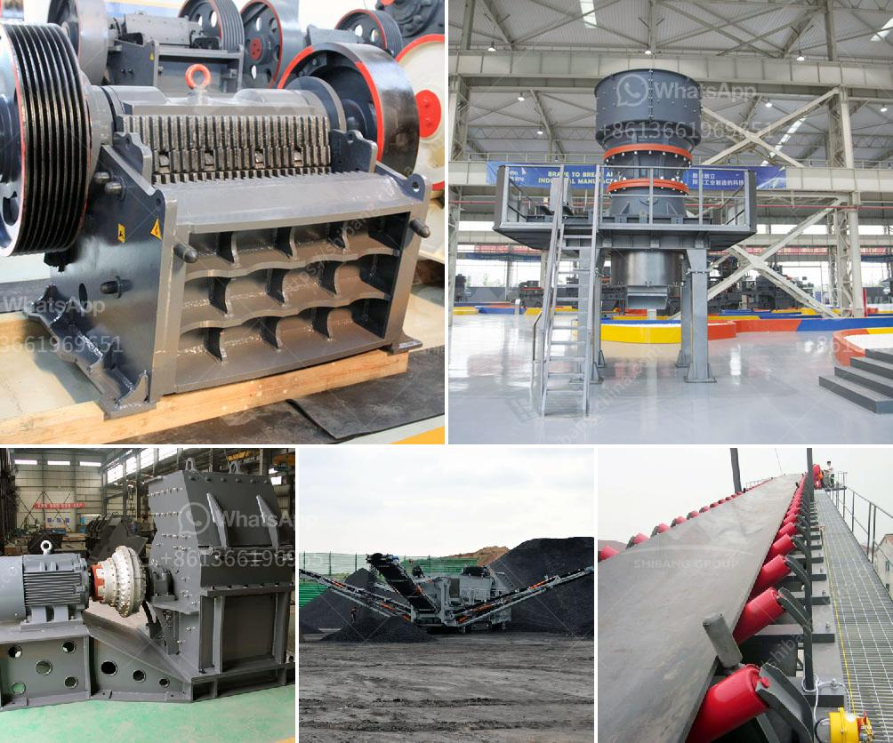

<h3>mobile crusher for rent in uae</h3>
Mobile crushers provide the advantage of convenient movement from one place to another, thus making it easier and more affordable compared to other types of crushers. Mobile crushers are widely used in the mining industry, construction material, and recycling industry.

In the mining industry, mobile crushers can be used for crushing various types of ores and rocks, such as iron ore, copper ore, manganese ore, limestone, granite, basalt, etc. In the construction material industry, the mobile crushers are utilized for crushing concrete, asphalt, and other construction materials. In the recycling industry, mobile crushers are used to process and crush demolition waste, concrete, bricks, and other materials.

Renting a mobile crusher in the UAE can solve a lot of problems, especially when dealing with temporary jobsites. Rental mobile crushers can benefit both contractors and businesses in terms of flexibility and cost savings. Contractors can save on transportation costs and eliminate the need for additional equipment such as loaders, excavators, and dump trucks. Renting a mobile crusher also allows for the recycling of materials on-site, reducing the amount of waste and protecting the environment.

When renting a mobile crusher in the UAE, it is important to consider several factors to ensure its suitability for the job. First and foremost, one should choose a reliable rental company that offers quality equipment and efficient service. The rental company should have a wide range of mobile crushers to choose from, with different sizes and capacities to meet the specific requirements of the project.

The rental rates should also be competitive and transparent, with no hidden costs or additional charges. It is important to discuss the duration of the rental period and any additional services or maintenance that may be required during this time. The rental company should also provide reliable technical support and assistance in case of any issues or breakdowns with the mobile crusher.

Additionally, it is crucial to check the condition and functionality of the mobile crusher before renting. The crusher should be in good working condition, with all necessary safety features and protections. It is recommended to inspect the crusher personally or request detailed photos and specifications if unable to do so.

In conclusion, renting a mobile crusher in the UAE can be a cost-effective and practical solution for many construction and mining projects. Mobile crushers provide flexibility and convenience, allowing for easy transportation between different jobsites. The rental rates should be competitive, and the rental company should offer reliable equipment, efficient service, and technical support. By considering these factors and choosing the right rental company, contractors and businesses can benefit from the advantages of mobile crushers in the UAE.
<h3>Contact us</h3><ul><li><strong>Whatsapp:&nbsp;<a href="https://wa.me/8613661969651">+8613661969651</a></strong></li><li><a href="https://swt.shibang-china.com/?git&amp;zhl&amp;mobile crusher for rent in uae"><strong>Online Service(chat now)</strong></a></li></ul><h3>Related</h3><ul><li><a href='stone crusher in malaysia.md'>stone crusher in malaysia</a></li><li><a href='stone crusher fairs.md'>stone crusher fairs</a></li><li><a href='stone quarry machine manufacturers.md'>stone quarry machine manufacturers</a></li><li><a href='small crushers for sale.md'>small crushers for sale</a></li><li><a href='activated carbon plant business plan.md'>activated carbon plant business plan</a></li></ul>