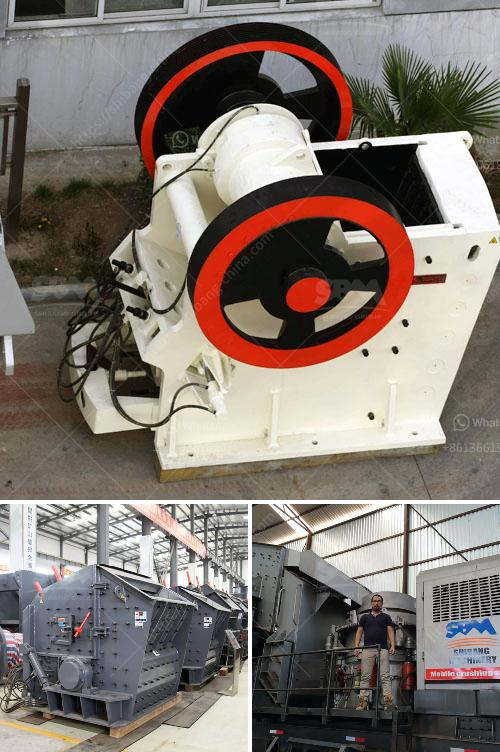

<h3>mobile crusher for salt</h3>
Salt is a mineral resource that is essential for our daily lives. It is commonly used in the food industry, as well as in various other sectors. As the demand for salt continues to rise, the need for efficient processing equipment also increases. This is where mobile crushers come into play. 

Mobile crushers are highly efficient and flexible crushing machines that can be easily transported from one site to another. They are particularly used in the mining industry, where they can process large amounts of raw materials. In the case of salt, mobile crushers are used to break down chunks of rock salt into smaller, more manageable pieces. 

One of the main advantages of using mobile crushers for salt processing is the flexibility they offer. These machines can be transported to different locations within a mining site, allowing for easy access to the salt deposits. This ensures that the salt can be mined and processed in the most efficient way possible.

Additionally, mobile crushers are equipped with features that improve their performance and productivity. For example, many mobile crushers are equipped with a vibrating feeder that ensures a consistent flow of salt into the crushing chamber. This helps maximize the efficiency of the crushing process and reduces the chances of blockages.

Furthermore, mobile crushers are designed to be highly durable and reliable. They are built to withstand the harsh conditions of a mining site, such as extreme temperatures and high levels of dust and debris. This ensures that the crushers can continue to operate efficiently, even in challenging environments.

Another advantage of using mobile crushers for salt processing is their low operating costs. These machines are designed to consume less energy and produce less waste compared to traditional crushing equipment. This not only reduces the environmental impact of the salt processing operation but also helps to lower operational costs for the mining company.

In addition to their efficiency and cost-effectiveness, mobile crushers also offer a high level of safety. They are equipped with various safety features, such as emergency stop buttons and safety guards, to protect operators and prevent accidents. This is particularly important in the mining industry, where safety is a top priority.

Overall, mobile crushers have revolutionized the salt processing industry. Their flexibility, efficiency, durability, low operating costs, and safety features make them an ideal choice for mining companies looking to extract and process salt in the most efficient and sustainable way possible.

It is clear that mobile crushers play a crucial role in the salt processing industry. Their ability to process large quantities of salt, while being highly portable and efficient, makes them an indispensable tool for mining companies. As the demand for salt continues to grow, the use of mobile crushers will only become more prevalent.  Whether in the food industry or other sectors, mobile crushers are paving the way for efficient and sustainable salt processing.
<h3>Contact us</h3><ul><li><strong>Whatsapp:&nbsp;<a href="https://wa.me/8613661969651">+8613661969651</a></strong></li><li><a href="https://swt.shibang-china.com/?git&amp;zhl&amp;mobile crusher for salt"><strong>Online Service(chat now)</strong></a></li></ul><h3>Related</h3><ul><li><a href='gold washing machine for sale in tanzania.md'>gold washing machine for sale in tanzania</a></li><li><a href='california rock crusher machine.md'>california rock crusher machine</a></li><li><a href='portable ballast crusher for sale.md'>portable ballast crusher for sale</a></li><li><a href='crushed stones aggregate in uganda.md'>crushed stones aggregate in uganda</a></li><li><a href='ball mill screen 200 tph.md'>ball mill screen 200 tph</a></li></ul>