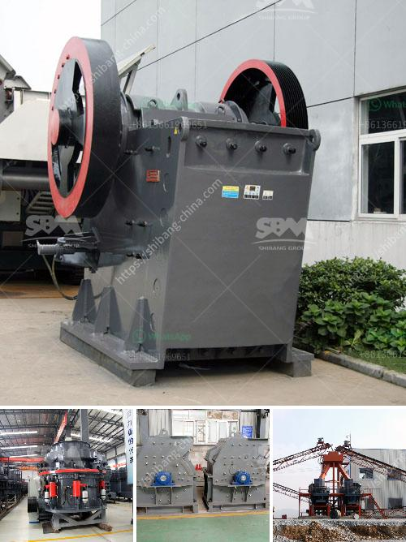

<h3>mobile crusher hire in south africa</h3>
Mobile crushers are used for crushing stones and rocks into gravel, aggregate, and even sand. They are commonly used in recycling, metallurgy, mining, infrastructure development, and construction industries. Mobile crushers are also known as "rock breakers" or "rock crushers." The popularity of mobile crushers has grown significantly over the years as they offer numerous advantages over traditional crushing equipment.

One of the primary benefits of mobile crushers is their versatility. They can be used for various types of materials, including concrete, rubble, asphalt, and rocks. Mobile crushers are designed to process different types and sizes of materials efficiently, making them ideal for various applications. Whether you need to crush materials for a road construction project or mining operation, mobile crushers can handle the task effectively.

In South Africa, where long-distance haulage is costly, the availability of mobile crushers makes the crushing process convenient and cost-effective. Mobile crushers are commonly used in the mining industry for reducing the size of ore in preparation for further processing. However, mobile crushers can also be used for recycling and reusing crushed materials on site, reducing the need for additional equipment and transportation costs.

Another advantage of mobile crushers is their easy and quick setup time. Mobile crushers can be transported to the construction site and assembled on-site within a short period. This minimizes the downtime and allows for immediate crushing operations. Additionally, mobile crushers can be operated remotely, reducing the risk of injuries and increasing safety on the job site.

For those looking to rent a mobile crusher in South Africa, there are plenty of options available. Many companies offer rental services, ranging from daily, weekly, or monthly basis. Some mobile crusher manufacturers and suppliers also provide training and technical support to the operators and maintenance crew, making the whole rental process hassle-free.

Overall, mobile crusher hire provides an efficient, versatile, and cost-effective solution for crushing materials in South Africa. This is ideal for industrial, mining, and recycling applications. Contact a reputable mobile crusher provider today to explore your options when it comes to mobile crushers in South Africa.
<h3>Contact us</h3><ul><li><strong>Whatsapp:&nbsp;<a href="https://wa.me/8613661969651">+8613661969651</a></strong></li><li><a href="https://swt.shibang-china.com/?git&amp;zhl&amp;mobile crusher hire in south africa"><strong>Online Service(chat now)</strong></a></li></ul><h3>Related</h3><ul><li><a href='potential of mica wet grinding plant.md'>potential of mica wet grinding plant</a></li><li><a href='small scale gold processing machines price list.md'>small scale gold processing machines price list</a></li><li><a href='quote for hydraulic cone crusher.md'>quote for hydraulic cone crusher</a></li><li><a href='coal grinding machinery manufacture in india.md'>coal grinding machinery manufacture in india</a></li><li><a href='crushing and screening process.md'>crushing and screening process</a></li></ul>