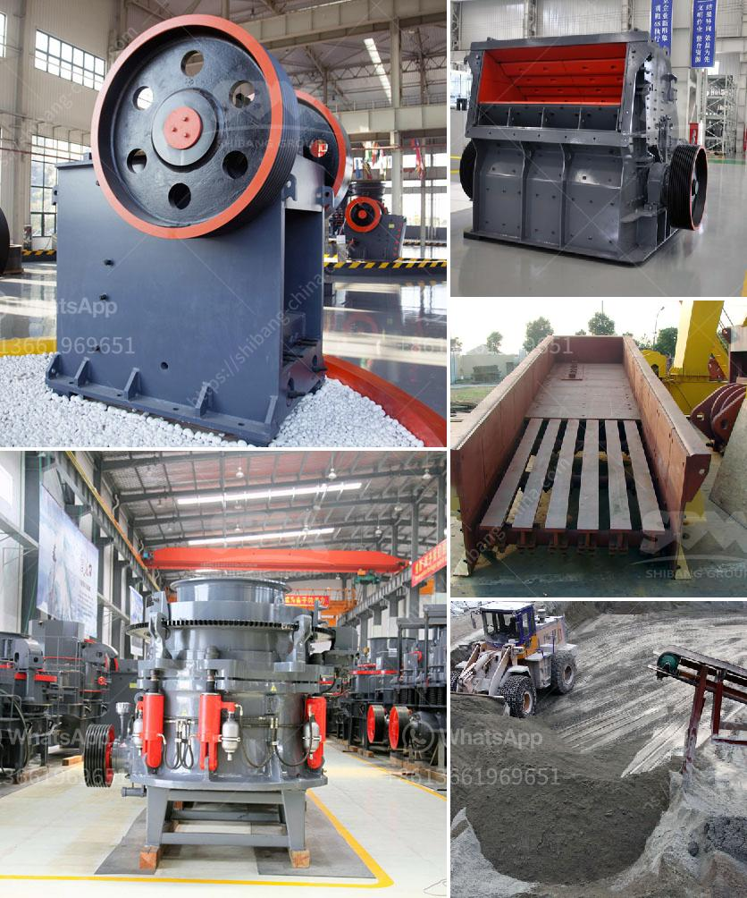

<h3>mobile crusher italy</h3>
The mobile crusher, also known as the mobile crushing plant, is a simple and efficient machine designed to produce crushed stone aggregate for construction projects. This powerful equipment consists of a crushing unit that utilizes a cone crusher and a vibrating screen, thus improving its efficiency and productivity.

Italy is renowned for its high-quality construction materials, and this has led to a significant increase in the demand for mobile crushers. These crushers are particularly suitable for projects where space is limited or where the site needs to be constantly relocated. Their small size and mobility allow operators to easily transport them from one site to another, saving time and reducing costs.

One of the significant advantages of mobile crushers is their ability to crush materials directly on-site, eliminating the need to transport materials to a stationary crusher. This not only saves money on transportation but also reduces the environmental impact of the project.

Mobile crushers in Italy are widely used in the construction industry and provide excellent crushing performance in a variety of construction materials such as granite, limestone, sandstone, and basalt. With the increasing demand for Italian construction materials, the mobile crusher market in Italy is expected to grow at a significant rate in the coming years.

Additionally, the Italian government has introduced various incentives and subsidies to promote the use of mobile crushers in construction projects. These initiatives aim to reduce the country's dependence on imported construction materials while boosting the local economy.

In conclusion, mobile crushers in Italy are versatile and efficient machines that contribute to the growth of the construction industry. Their ability to crush materials directly on-site offers numerous advantages such as cost savings, environmental sustainability, and increased productivity. With the continuous advancements in technology, the future of mobile crushers in Italy appears promising, and they will undoubtedly play a crucial role in meeting the growing construction material demands of the country.
<h3>Contact us</h3><ul><li><strong>Whatsapp:&nbsp;<a href="https://wa.me/8613661969651">+8613661969651</a></strong></li><li><a href="https://swt.shibang-china.com/?git&amp;zhl&amp;mobile crusher italy"><strong>Online Service(chat now)</strong></a></li></ul><h3>Related</h3><ul><li><a href='ball mills vietnam.md'>ball mills vietnam</a></li><li><a href='business plan on manganese ore mining.md'>business plan on manganese ore mining</a></li><li><a href='jual stone crusher merk.md'>jual stone crusher merk</a></li><li><a href='sand quarry plant.md'>sand quarry plant</a></li><li><a href='enquiry about rock crusher.md'>enquiry about rock crusher</a></li></ul>