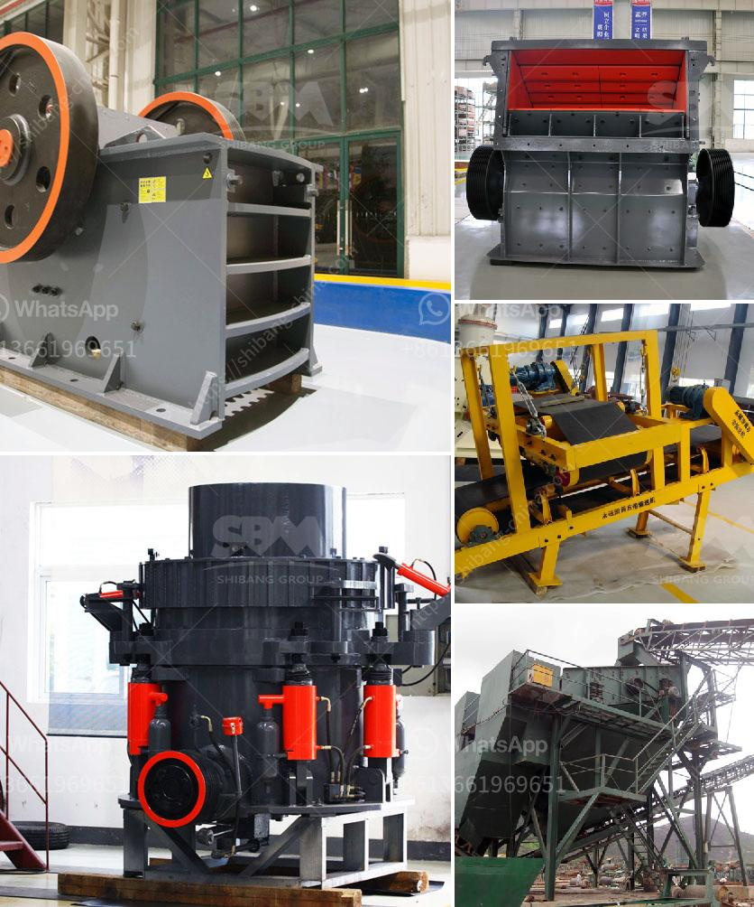

<h3>mobile crusher namibia</h3>
Namibia is renowned for its untamed beauty, vast landscapes, and diverse wildlife. It's no wonder that this southern African country has become a hotspot for adventurous tourists seeking an unforgettable experience. However, the construction industry in Namibia has also seen significant growth in recent years, leading to an increasing demand for construction materials, including crushed stone, gravel, and sand. This is where mobile crushers come into play, revolutionizing the way materials are processed and delivered.

Mobile crushers are versatile machines that are used to reduce the size of rocks and other materials for further processing. Whether it's a construction site or a quarry, these crushers are designed to handle a wide range of materials, including concrete, asphalt, and natural stone. With their mobility and ability to work in tight spaces, mobile crushers are the perfect solution for crushing operations in Namibia.

One company leading the way in mobile crushing in Namibia is Pilot Crushtec International. With over 30 years of experience in the industry, Pilot Crushtec has established itself as a leading supplier of mobile and semi-mobile crushing and screening solutions. Their range of mobile crushers includes jaw crushers, impact crushers, and cone crushers, all equipped with the latest technology to ensure efficient and reliable performance.

One of the key advantages of mobile crushers is their ability to be transported easily from one site to another. This means that crushing can be done on-site, reducing the need for costly transportation of materials. Additionally, mobile crushers can be quickly set up and dismantled, allowing for fast and efficient production.

Furthermore, mobile crushers are equipped with advanced features to increase productivity and ease of use. Many models come with remote control capabilities, allowing operators to adjust settings and monitor performance from a safe distance. This not only improves operator safety but also ensures optimal efficiency during the crushing process.

In conclusion, mobile crushers have revolutionized the construction industry in Namibia. Their mobility, versatility, and advanced features make them indispensable for crushing operations in this beautiful country. Whether it's reducing the size of rocks for further processing or crushing concrete for recycling, mobile crushers are the go-to solution for the demanding construction industry in Namibia. With companies like Pilot Crushtec leading the way, Namibia is set to benefit from the advantages that mobile crushers bring, ensuring that the construction industry continues to thrive while preserving the country's natural beauty.
<h3>Contact us</h3><ul><li><strong>Whatsapp:&nbsp;<a href="https://wa.me/8613661969651">+8613661969651</a></strong></li><li><a href="https://swt.shibang-china.com/?git&amp;zhl&amp;mobile crusher namibia"><strong>Online Service(chat now)</strong></a></li></ul><h3>Related</h3><ul><li><a href='slag processing plant manufacturers in chile.md'>slag processing plant manufacturers in chile</a></li><li><a href='stone crushing equipment available in northern cape.md'>stone crushing equipment available in northern cape</a></li><li><a href='how much cost silicon quartz stone.md'>how much cost silicon quartz stone</a></li><li><a href='cost of building calcium carbonate factory.md'>cost of building calcium carbonate factory</a></li><li><a href='price of portable stonecrusher.md'>price of portable stonecrusher</a></li></ul>