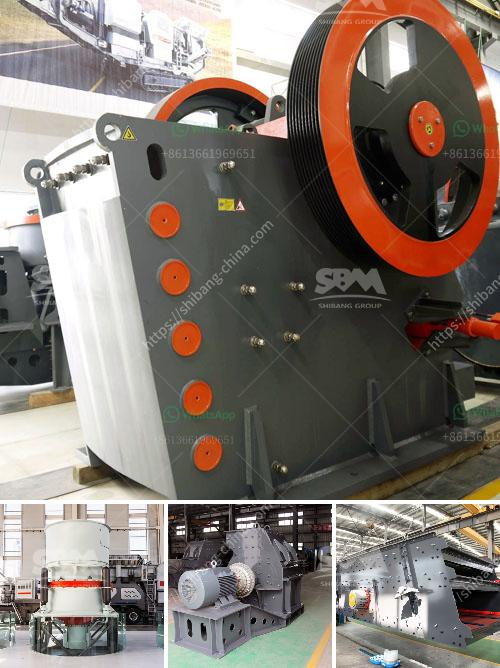

<h3>mobile crusher on rent in chennai</h3>
In today's rapidly evolving construction industry, having the right equipment and machinery is crucial to completing projects efficiently and effectively. One such machine that has made a significant impact in the construction field is the mobile crusher. With the ability to process materials on-site, these high-performance crushers have become an essential tool for contractors and builders.

Chennai, the capital city of Tamil Nadu, is witnessing a surge in construction activities, thanks to the growing infrastructure development and real estate projects. As a result, the demand for mobile crushers on rent in Chennai is on the rise.

Mobile crushers are efficient, versatile machines that provide an effective way to process materials such as asphalt, concrete, stones, and various other materials. These crushers utilize heavy-duty engines and powerful crushing mechanisms to reduce the size of large rocks or demolition debris into smaller pieces.

There are several benefits of renting a mobile crusher in Chennai rather than buying one outright. Firstly, renting offers a cost-effective solution for short-term projects or when the need for a crusher is temporary. Renting also eliminates the need for costly maintenance and repairs, as the owner or rental company is responsible for these tasks.

Another advantage of renting a mobile crusher is the flexibility it offers. Contractors and builders can choose from a wide range of crushers based on their specific requirements, such as size, capacity, and mobility. This ensures that they can find the perfect machine for each job, whether it's a small-scale residential project or a large commercial construction.

Additionally, renting mobile crushers in Chennai provides the opportunity to try out different models and brands before deciding to purchase one. This allows contractors to assess the machine's performance and suitability for their projects, ensuring optimal results and cost-efficiency.

The rental process for mobile crushers in Chennai is typically straightforward and hassle-free. Rental companies usually have a fleet of well-maintained machines available for rent, with different options for duration and rental terms. Customers can contact these rental companies, provide their project details, and get a quote for the required mobile crusher.

Once the rental agreement is finalized, the mobile crusher is delivered to the project site and set up by the rental company. Most rental companies also offer technical support and assistance, ensuring that the crusher operates smoothly and efficiently throughout the project.

In conclusion, renting a mobile crusher in Chennai has become a popular choice for contractors and builders due to its cost-effectiveness, flexibility, and convenience. With the growing construction activities in the city, mobile crushers provide an efficient solution for processing materials on-site, saving time, and reducing transportation costs.

Whether it's crushing concrete for road construction or processing stones for a landscaping project, renting a mobile crusher in Chennai ensures that contractors have the right equipment to complete their jobs efficiently. By choosing to rent, contractors can focus on their core activities while leaving the maintenance and repairs to the rental company, making the rental process a win-win situation for all parties involved.
<h3>Contact us</h3><ul><li><strong>Whatsapp:&nbsp;<a href="https://wa.me/8613661969651">+8613661969651</a></strong></li><li><a href="https://swt.shibang-china.com/?git&amp;zhl&amp;mobile crusher on rent in chennai"><strong>Online Service(chat now)</strong></a></li></ul><h3>Related</h3><ul><li><a href='impact crusher specification limestone.md'>impact crusher specification limestone</a></li><li><a href='defination of machine aggregate crusher.md'>defination of machine aggregate crusher</a></li><li><a href='stone crusher machine in saudi arabia.md'>stone crusher machine in saudi arabia</a></li><li><a href='mobile concrete crusher.md'>mobile concrete crusher</a></li><li><a href='german zenith made mobile stone crusher.md'>german zenith made mobile stone crusher</a></li></ul>