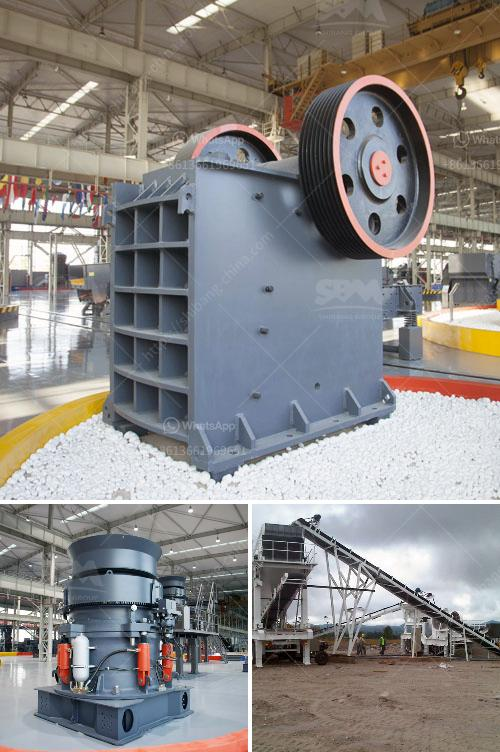

<h3>mobile crusher parker 50th crusher for sale</h3>
Moving towards a more sustainable future, the demand for efficient and effective crushing equipment continues to rise. When it comes to portable crushing plants, Parker is renowned for its high-quality crushers. The Parker 50th mobile crusher is a prime example of their dedication to providing users with reliable equipment that is both versatile and powerful. This article explores the features and benefits of the Parker 50th crusher, highlighting why it is the perfect solution for those in need of a portable crushing option.

At the heart of the Parker 50th mobile crusher is its powerful jaw crusher. With a feed opening of 1100mm x 650mm, this crusher can handle even the toughest materials with ease. Its 50 tonne weight enables it to crush large volumes of rock, concrete, asphalt, and other aggregates efficiently. Whether you are working in a quarry, construction site, or demolition project, the Parker 50th crusher delivers exceptional performance every time.

One of the key advantages of this mobile crusher is its mobility. Equipped with tracks, it can easily navigate through rough terrains and access hard-to-reach areas. The ability to move the crusher to different locations eliminates the need for multiple units, reducing costs and increasing efficiency. Whether you need to crush material in one spot or move to another site, the Parker 50th crusher ensures you can get the job done quickly and effectively.

In addition to its mobility, the Parker 50th mobile crusher offers a wide range of customizable options to suit your specific needs. With different jaw plates and settings, you can achieve the desired output size, whether it be fine or coarse. The hydraulically adjustable CSS (Closed Side Setting) allows for precise control over the final product, ensuring optimal results.

Maintenance is also a breeze with the Parker 50th crusher. Its innovative design prioritizes easy access to key components, making routine inspections and repairs quick and hassle-free. A centralized lubrication system reduces the risk of breakdowns due to improper lubrication, ensuring the crusher operates efficiently for longer periods.

Furthermore, safety is a top priority with the Parker 50th mobile crusher. It is equipped with a range of safety features, including emergency stop buttons and safety guards. These features promote safe operation, protecting both the operator and the equipment from potential hazards.

As with all Parker crushers, the 50th model is built to last. The robust construction and high-quality materials used in its manufacturing guarantee years of reliable performance. This longevity, alongside Parker's renowned after-sales service and support, gives operators peace of mind, knowing they have invested in a durable and reliable crushing solution.

In conclusion, the Parker 50th mobile crusher is the ideal solution for those seeking a portable and powerful crushing option. Its versatility, mobility, and customizable options make it a top choice for various applications, from quarrying to recycling. With its strong performance, easy maintenance, and commitment to safety, the Parker 50th crusher ensures operators can efficiently crush materials on the go while maintaining the highest standards of productivity and quality.
<h3>Contact us</h3><ul><li><strong>Whatsapp:&nbsp;<a href="https://wa.me/8613661969651">+8613661969651</a></strong></li><li><a href="https://swt.shibang-china.com/?git&amp;zhl&amp;mobile crusher parker 50th crusher for sale"><strong>Online Service(chat now)</strong></a></li></ul><h3>Related</h3><ul><li><a href='types conveyor belts.md'>types conveyor belts</a></li><li><a href='used sand making machine dealers.md'>used sand making machine dealers</a></li><li><a href='crushing machine manufacturer in maharashtra.md'>crushing machine manufacturer in maharashtra</a></li><li><a href='principle of cone crusher.md'>principle of cone crusher</a></li><li><a href='puzzolana 100tph cone crusher plant price.md'>puzzolana 100tph cone crusher plant price</a></li></ul>