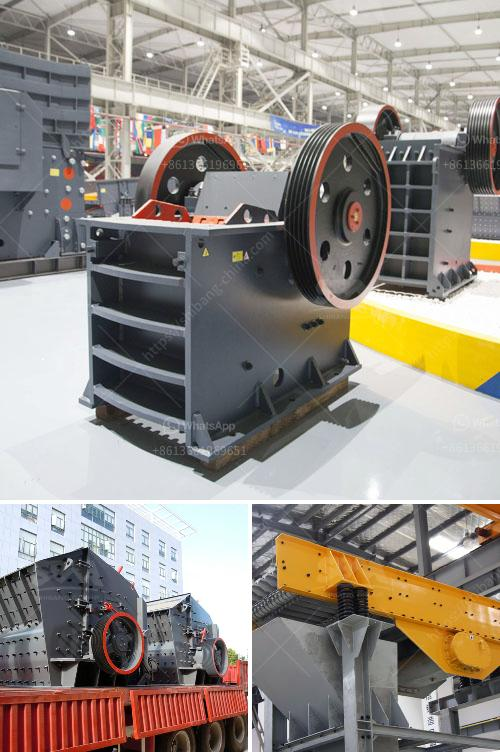

<h3>mobile crusher prices in philippines</h3>
Mobile crusher machine is the most widely used crusher machine in the world. The mobile crusher machine price in Philippines is determined by the model and capacity. There are many factors to consider when selecting a mobile crusher machine, such as the capacity for crushing various materials like stone, granite, limestone, and iron ore, etc., the ease of operation, and maintenance, etc. The mobile crusher machine provides a new field of business opportunities for contractors, quarry operators, recycling and mining applications.

The price of a mobile crusher in Philippines ranges from PHP 3,500,000 to PHP 64,000,000. The mobile crusher can crush various materials such as construction waste, river pebbles, granite, basalt, limestone, etc. It can also produce different types of finished materials according to the requirements of the user. For example, finished stones of different sizes can be produced by adjusting the discharge port of the mobile crusher. This flexibility makes the mobile crusher an ideal choice for various construction projects.

In addition, the mobile crusher machine has the advantages of high economy, low power consumption, low noise, less dust pollution, reliable performance, and convenient maintenance. With the gradual improvement of infrastructure in the Philippines, the demand for mobile crushers is growing. Mobile crushers are widely used in various industries such as mining, metallurgy, building materials, highways, railways, water conservancy, and chemical industries.

The price of mobile crusher machines in the Philippines not only depends on the model and capacity but also varies with the brand and market competition factors. Experts predict that the Philippine mobile crusher market will gradually develop in the future. Therefore, when purchasing a mobile crusher in the Philippines, users should also consider factors such as equipment quality, after-sales service, and overall investment cost to make a wise decision. In summary, the mobile crusher machine has brought great convenience to users and created huge economic benefits, making it an essential equipment in the Philippines crushing and screening industry.
<h3>Contact us</h3><ul><li><strong>Whatsapp:&nbsp;<a href="https://wa.me/8613661969651">+8613661969651</a></strong></li><li><a href="https://swt.shibang-china.com/?git&amp;zhl&amp;mobile crusher prices in philippines"><strong>Online Service(chat now)</strong></a></li></ul><h3>Related</h3><ul><li><a href='copper ore processing plant kenya.md'>copper ore processing plant kenya</a></li><li><a href='aggregate washing plant saudi arabia.md'>aggregate washing plant saudi arabia</a></li><li><a href='used stone crushers for sale india.md'>used stone crushers for sale india</a></li><li><a href='mobile impact crusher in road construction.md'>mobile impact crusher in road construction</a></li><li><a href='small scale tantalum milling machine supplier.md'>small scale tantalum milling machine supplier</a></li></ul>