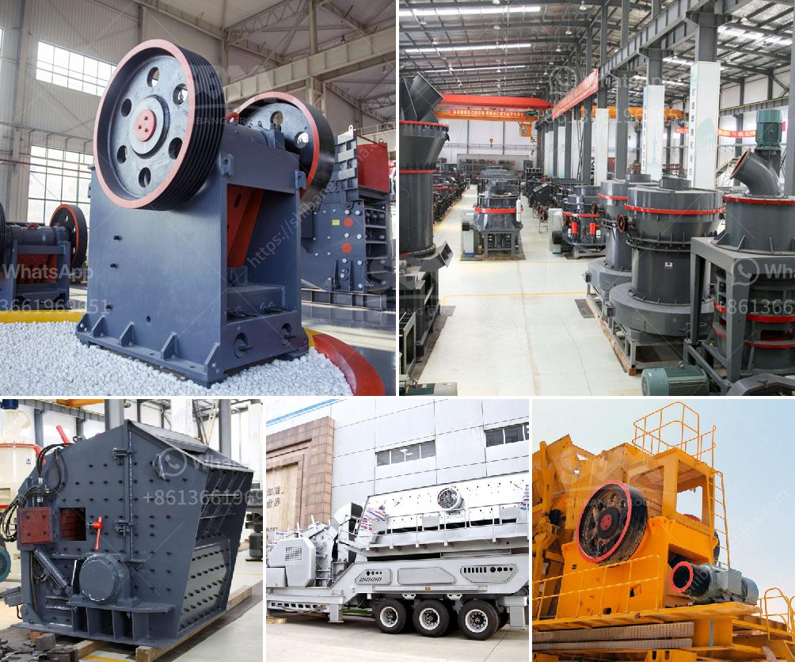

<h3>mobile crusher tph</h3>
In recent years, mobile crushers have been increasingly employed in the field of environmental recycling that utilizes various construction wastes. As the name suggests, a mobile crusher can be moved and installed on a construction site, allowing for it to be conveniently transported between different sites. This flexibility has led to the emergence of various innovative and efficient mobile crushers.

A mobile crusher TPH, which stands for tons per hour, is a specialized machine that can deliver incredible efficiency and crushing capabilities even in the harshest of conditions. With a maximum capacity of 300-500 tons per hour, this machine can help you tackle large-scale crushing projects with ease.

One of the key benefits of a mobile crusher TPH is its efficiency in crushing and recycling materials. With the ability to crush a wide range of materials, including concrete, rock, asphalt, and more, this machine significantly reduces the need for conventional crushing equipment on-site. Instead of relying on large machinery that requires extensive maintenance, a mobile crusher TPH can handle the task of crushing on its own.

Furthermore, a mobile crusher TPH offers exceptional mobility, allowing it to reach even the most remote locations. This is particularly useful in construction sites that are situated far away from recycling facilities or where transportation costs are high. By crushing materials on-site, transportation costs can be greatly reduced.

The technological advancements in mobile crushers have also contributed to their popularity. Equipped with advanced features, a mobile crusher TPH offers precise control over the crushing process. This ensures uniform and high-quality output, meeting the required specifications for various construction applications.

Additionally, safety has been a crucial focus in the development of mobile crushers. Many machines are equipped with advanced safety features, including remote control operation and automatic shut-off systems. These features not only enhance the safety of workers but also reduce the risk of accidents and injuries on-site.

The use of mobile crushers also has a positive impact on the environment. By recycling materials on-site, construction waste is minimized, reducing the need for landfill space. Additionally, the reduction in transportation requirements contributes to the overall reduction of carbon emissions.

In conclusion, a mobile crusher TPH is a groundbreaking technology that revolutionizes the crushing industry. With its ability to crush a wide range of materials, exceptional mobility, advanced features, and environmental benefits, this machine is a game-changer. It provides contractors and construction companies with a cost-effective and efficient solution to their crushing needs. By investing in a mobile crusher TPH, you are paving the way for a more sustainable future in the construction industry.
<h3>Contact us</h3><ul><li><strong>Whatsapp:&nbsp;<a href="https://wa.me/8613661969651">+8613661969651</a></strong></li><li><a href="https://swt.shibang-china.com/?git&amp;zhl&amp;mobile crusher tph"><strong>Online Service(chat now)</strong></a></li></ul><h3>Related</h3><ul><li><a href='bentonite processing plant alibaba.md'>bentonite processing plant alibaba</a></li><li><a href='crushers manufacturers in south africa.md'>crushers manufacturers in south africa</a></li><li><a href='ball mill laboratory philippines.md'>ball mill laboratory philippines</a></li><li><a href='crusher machine manufacturer in coimbatore.md'>crusher machine manufacturer in coimbatore</a></li><li><a href='granite tiles processing machines.md'>granite tiles processing machines</a></li></ul>