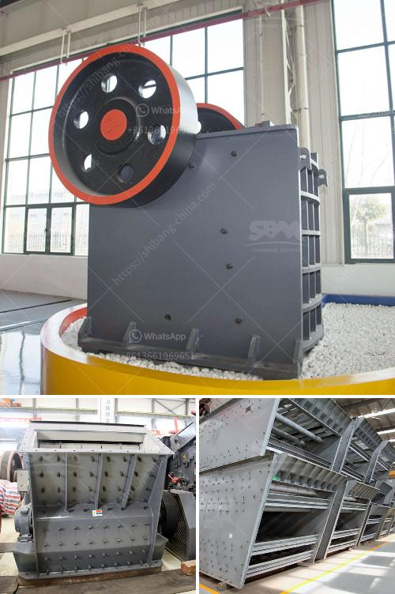

<h3>mobile crusher tunisia</h3>
Mobile crushers are gaining in popularity in the recycling industry in Tunisia as well as worldwide. These machines are versatile and can be used to process a wide variety of materials such as construction debris, demolition waste, aggregates, and even recyclable materials.

In Tunisia, there is a growing demand for these machines due to the rapid urbanization and infrastructure development projects in the country. Mobile crushers offer numerous advantages over stationary crushers, such as flexibility and mobility, reducing the need for transport of materials to a stationary crusher plant.

With mobile crushers, materials can be crushed on-site and immediately reused for various purposes. This eliminates the transportation cost and time required for traditional crushing methods, which is especially important in a country like Tunisia where the cost of transportation can be high. Additionally, mobile crushers provide the ability to produce different sizes of products, making them suitable for a wide range of applications.

One of the main advantages of mobile crushers is their ability to be easily moved from one site to another. This means that they can be quickly set up and dismantled, allowing contractors to bring the crusher closer to the material source. This leads to shorter transport distances and reduced fuel consumption, resulting in lower carbon emissions. Furthermore, mobile crushers are equipped with advanced features such as remote control, making them easy to operate and maintain.

In Tunisia, mobile crushers are commonly used in construction and demolition projects. These machines can process a variety of materials, including concrete, bricks, asphalt, and metals. Mobile crushers are often used in recycling applications, as they can reduce the waste directly on-site and transform the leftovers into a valuable product. The recycled materials can be reused in the same project or sold to generate additional revenue.

The use of mobile crushers in Tunisia is also beneficial for the environment. By recycling construction and demolition waste, fewer raw materials need to be extracted, reducing the strain on natural resources. Additionally, recycling reduces the amount of waste sent to landfills, leading to lower methane emissions and a cleaner environment.

Mobile crushers have proven to be a reliable solution for recycling applications in Tunisia. They provide cost-effective and environmentally-friendly options for processing various materials, allowing contractors to save time, money, and resources. As the demand for mobile crushers continues to grow, manufacturers are developing new models with improved features and efficiency.

In conclusion, the use of mobile crushers in Tunisia benefits both the economy and the environment. These machines offer flexibility, mobility, and cost-saving advantages compared to traditional stationary crushers. With the ability to process various materials on-site, mobile crushers contribute to reducing transportation costs and carbon emissions. Furthermore, the recycling capabilities of mobile crushers help conserve natural resources and reduce waste sent to landfills. As the construction and recycling industries continue to grow in Tunisia, mobile crushers are likely to play a significant role in meeting the increasing demand for efficient and sustainable crushing solutions.
<h3>Contact us</h3><ul><li><strong>Whatsapp:&nbsp;<a href="https://wa.me/8613661969651">+8613661969651</a></strong></li><li><a href="https://swt.shibang-china.com/?git&amp;zhl&amp;mobile crusher tunisia"><strong>Online Service(chat now)</strong></a></li></ul><h3>Related</h3><ul><li><a href='company that sells vibratory sieves in spain.md'>company that sells vibratory sieves in spain</a></li><li><a href='slag grinding machine in india.md'>slag grinding machine in india</a></li><li><a href='ball mill machine in china.md'>ball mill machine in china</a></li><li><a href='europe crusher producers.md'>europe crusher producers</a></li><li><a href='gypsum bord plant factorie price.md'>gypsum bord plant factorie price</a></li></ul>