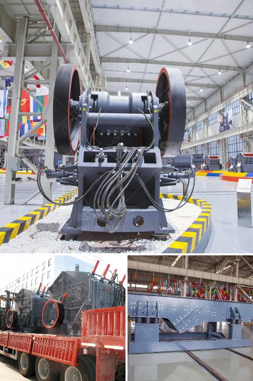

<h3>mobile crusher wanted for rent in johor</h3>
In today's fast-paced world, the demand for construction materials is higher than ever, with new infrastructure projects popping up left and right. With this increase in demand, contractors and construction companies are constantly seeking innovative ways to meet the needs of their projects efficiently. One such solution that has gained popularity in recent years is the use of mobile crushers.

Mobile crushers are heavy machinery designed to crush large rocks into smaller gravel or rubble. They are versatile, practical, and offer many advantages over traditional stationary crushers. The ability to move them around a job site quickly and easily makes them a valuable tool for construction projects.

In the southern region of Malaysia, Johor is experiencing a surge in construction activities. As a result, the demand for construction materials in the area is soaring high. To keep up with this demand, many companies in Johor are in dire need of mobile crushers for rent.

Renting mobile crushers in Johor offers numerous benefits for construction companies and contractors. Firstly, it eliminates the need for a substantial capital investment. Purchasing heavy machinery like crushers can be a costly affair, especially for smaller companies. Renting allows them to access the equipment they need without the financial burden of purchasing it outright.

Additionally, renting a mobile crusher provides flexibility. Construction projects in Johor vary in duration and scale, and the equipment needs for each project can be different. Renting allows companies to choose the specific model and size of the crusher that best suits their requirements for each project. This flexibility ensures that they have the right equipment at the right time, optimizing productivity and efficiency.

Another advantage of renting mobile crushers is the reduced maintenance and repair costs. When you own heavy machinery, you are responsible for its maintenance, repairs, and any associated downtime. Renting, on the other hand, relieves you from these responsibilities. The rental company takes care of any maintenance and repairs, ensuring that the equipment is in excellent working condition throughout the duration of the rental period.

Renting mobile crushers in Johor also provides access to the latest technology. The construction industry is constantly evolving, with new technologies being introduced regularly. Renting equipment allows companies to use the most advanced crushers available, maximizing productivity and ensuring a competitive edge.

To cater to the growing demand for rental mobile crushers in Johor, numerous rental companies have emerged in the region. These companies offer a wide range of mobile crushers, including jaw crushers, impact crushers, and cone crushers. They provide flexible rental terms, competitive pricing, and excellent customer service, ensuring a hassle-free experience for their clients.

In conclusion, the demand for construction materials in Johor is skyrocketing, necessitating the use of efficient crushing equipment. Renting mobile crushers offers numerous advantages for construction companies and contractors in the region. It eliminates the need for significant capital investment, provides flexibility, reduces maintenance and repair costs, and grants access to the latest technology. With the increasing number of rental companies in Johor, finding the right mobile crusher for rent has never been easier.
<h3>Contact us</h3><ul><li><strong>Whatsapp:&nbsp;<a href="https://wa.me/8613661969651">+8613661969651</a></strong></li><li><a href="https://swt.shibang-china.com/?git&amp;zhl&amp;mobile crusher wanted for rent in johor"><strong>Online Service(chat now)</strong></a></li></ul><h3>Related</h3><ul><li><a href='crusher stone crusher 4 ton.md'>crusher stone crusher 4 ton</a></li><li><a href='mobile coal washing plant investment.md'>mobile coal washing plant investment</a></li><li><a href='quotation for stone crusher.md'>quotation for stone crusher</a></li><li><a href='sand mining for construction in equatorial guinea.md'>sand mining for construction in equatorial guinea</a></li><li><a href='portable crusher machine.md'>portable crusher machine</a></li></ul>