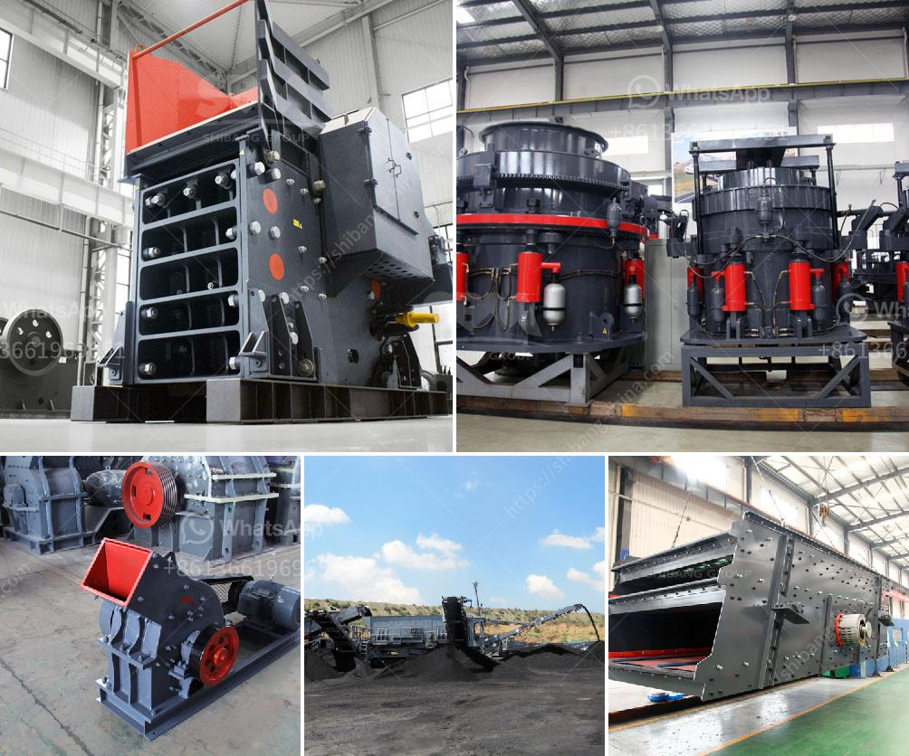

<h3>mobile crushers for sale ghana</h3>
Mobile crushers have been used for crushing stone for decades, and they have revolutionized the way people perform their work. They are designed to efficiently and quickly reduce large rocks into smaller rocks, gravel, or rock dust, which is vital for various construction projects. In Ghana, the mining and construction industries are growing rapidly, and mobile crushers are contributing towards this growth.

One of the key benefits of mobile crushers is their versatility. They can be used in various applications, such as recycling concrete, asphalt, and demolition waste. Additionally, they can be used to process natural stone, making them suitable for a wide range of projects. Whether it's crushing aggregates for road construction or mining operations, mobile crushers can easily handle different materials.

In Ghana, there is a wide range of mobile crushers available for sale, including jaw crushers, impact crushers, and cone crushers. These crushers can be used for primary, secondary, and tertiary crushing to break down different hardness materials. The most popular crushers in Ghana are jaw crushers. They are often used for primary crushing and are capable of breaking down large rocks into small stones.

Impact crushers are also commonly used in Ghana as secondary or tertiary crushers. They can crush materials with a medium to high hardness, making them suitable for a variety of applications. Cone crushers, on the other hand, are used for crushing medium-hard to hard materials. They are often used in the mining industry for processing ores and minerals.

Mobile crushers in Ghana are available in different sizes and capacities to suit various needs. They can be wheeled or tracked, allowing for easy transportation between sites. Wheeled crushers are more suitable for static construction projects, while tracked crushers are ideal for moving between different work sites.

When considering the purchase of a mobile crusher in Ghana, it is important to consider factors such as the production capacity, feed size, and final product size required. It is also crucial to choose a reputable manufacturer or supplier that can provide reliable and durable crushers.

Maintenance is another aspect that should not be overlooked when buying a mobile crusher. Regular maintenance is essential to ensure the longevity and efficiency of the equipment. By following the manufacturer's recommended maintenance schedule and guidelines, the crusher will continue to perform optimally.

In conclusion, mobile crushers for sale in Ghana have contributed significantly to the growth of the mining and construction industries. They offer versatility, allowing for the processing of various materials. Whether it's recycling concrete or crushing natural stone, mobile crushers can efficiently handle different applications. With proper maintenance and care, these crushers can provide years of reliable service.
<h3>Contact us</h3><ul><li><strong>Whatsapp:&nbsp;<a href="https://wa.me/8613661969651">+8613661969651</a></strong></li><li><a href="https://swt.shibang-china.com/?git&amp;zhl&amp;mobile crushers for sale ghana"><strong>Online Service(chat now)</strong></a></li></ul><h3>Related</h3><ul><li><a href='mobile coal jaw crusher for hire.md'>mobile coal jaw crusher for hire</a></li><li><a href='complete gold refinery for sale in south africa.md'>complete gold refinery for sale in south africa</a></li><li><a href='sand making machine from china.md'>sand making machine from china</a></li><li><a href='silica water washing plant manufacturers in india.md'>silica water washing plant manufacturers in india</a></li><li><a href='compact concrete crusher.md'>compact concrete crusher</a></li></ul>