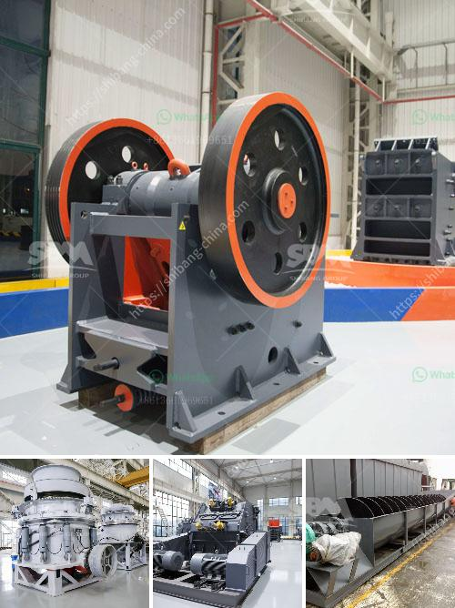

<h3>mobile crushers in malaysia</h3>
Mobile crushers are essential for the crushing of concrete and asphalt of various types. Available in different types, they are used as primary, secondary, as well as tertiary equipment for particle-on-particle crushing or for improving the quality of end material in terms of shape, size, and texture as well as for decreasing the wear and tear of the machine and several other important aspects. These units have tremendous importance in the construction industry in Malaysia as they can achieve high productivity and high reduction ratios.

The wide range of mobile crushers, from small compact units to large high-capacity ones, allows for a great level of flexibility when processing materials. The machines are able to operate independently or be calibrated to operate together, depending on the end-product requirements. With the unique mobility and flexibility of these units, there is an opportunity to enhance the productivity and efficiency of construction sites and accelerate the overall project completion.

The versatility of mobile crushers is evident in their common applications for concrete debris, brickwork, asphalt, as well as natural stone processing. These units are designed to process material that is difficult to handle, meaning their mobility is vital to ensure optimal performance. They are commonly used in important construction projects that require steady operation, relatively low maintenance, and easy transportation.

One of the key factors that contribute to the success of a mobile crusher is having a well-built chassis. This allows the machine to evenly distribute the crushing forces and helps to minimize the risks associated with potential damages due to the nature of the work. Malaysia's mobile crushers are mainly used in metallurgy, chemical industry, building materials, utilities and other industries which often need to move materials, especially for highway, railway and hydropower engineering.

According to the types, sizes and requirements of finished materials, users can use a variety of configuration forms of mobile stone crusher.Mobile crushing station is mainly used in metallurgy, chemical industry, building materials, water and electricity and other materials processing. It is often used for crushing materials in railway, highway, water conservancy and other industries. In particular, it is often used to crush limestone and other materials. The jaw crusher is used for the crushing of large feed particles in quarrying and mining operations, or on-site recycling of construction waste.

The mobile jaw crusher is equipped with a special wobbler feeder for prescreening to permit thorough screening of cohesive feed material. Since summer 2016, the plant has been operated by a SMBP limestone quarry, delivering finely graded limestone products. The simplest possible jaw crusher stage: Feeding all material from the dump hopper into the jaw crusher. This is not recommended due to a lack of control over the feed rate, minus-square, and size.

With other Kleemann crushers and screens following immediately afterwards, the primary crusher can be operated separately and in this way complete the screening stage, while the secondary crusher is fed from the bottom and maintains a choke feed to the crusher as described, ensuring that the crusher does not run out of material to crush, and efficiency is critical for optimum production.
<h3>Contact us</h3><ul><li><strong>Whatsapp:&nbsp;<a href="https://wa.me/8613661969651">+8613661969651</a></strong></li><li><a href="https://swt.shibang-china.com/?git&amp;zhl&amp;mobile crushers in malaysia"><strong>Online Service(chat now)</strong></a></li></ul><h3>Related</h3><ul><li><a href='flow chart for gold extraction from ores.md'>flow chart for gold extraction from ores</a></li><li><a href='calcium silicone crushers.md'>calcium silicone crushers</a></li><li><a href='kaolin crushing processing in india.md'>kaolin crushing processing in india</a></li><li><a href='equipments in gypsum powder production line.md'>equipments in gypsum powder production line</a></li><li><a href='manufacture of conveyor belts in bogota.md'>manufacture of conveyor belts in bogota</a></li></ul>