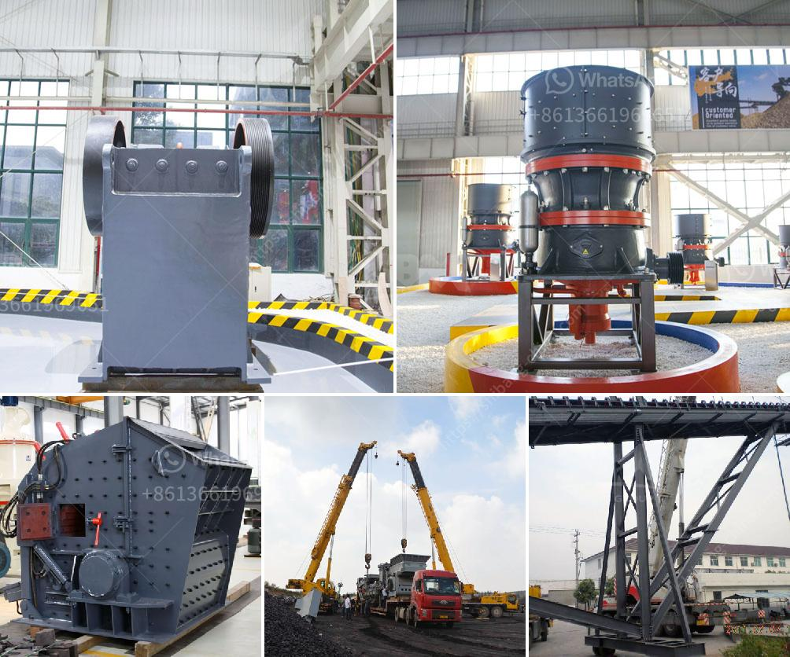

<h3>mobile crushers manufactureres in china</h3>
China is a major market for mobile crushers manufacturers with an increasing demand for these crushers due to the rapid growth in construction and infrastructure projects. China's urbanization rate has been steadily increasing, which has led to the development of roads, railway networks, and high-rise buildings. As a result, the need for crushed stones and other materials required for these projects has surged, creating a substantial market for mobile crushers manufacturers.

Mobile crushers are essential equipment in the construction industry, as they help break down large rocks into smaller, more manageable sizes. These crushers have tracks or wheels, making them easy to maneuver and transport to different sites. They are commonly used in quarries, demolition sites, and recycling applications. Their compact size and mobility allow operators to quickly set them up and start crushing materials, saving time and increasing productivity.

Several manufacturers in China specialize in producing mobile crushers to cater to the growing demand in the country and expand their presence globally. These manufacturers focus on developing advanced technologies to enhance the efficiency and performance of their crushers. They invest in research and development to improve the crushing capabilities of their machines, resulting in higher throughput rates and reduced downtime.

One of the leading mobile crushers manufacturers in China is SBM Machinery. SBM has been delivering quality crushing and screening solutions for construction and mining industries for over three decades. The company offers a wide range of mobile crushers, including jaw crushers, impact crushers, cone crushers, and screens, to meet various crushing requirements.

SBM's mobile crushers are known for their innovative features and rugged construction. They are designed to withstand harsh operating conditions and provide reliable performance even in the most demanding applications. SBM's mobile crushers incorporate advanced technologies, such as hydraulic systems, intelligent control systems, and energy-saving designs, to optimize crushing processes and improve overall efficiency.

Another prominent mobile crusher manufacturer in China is Henan Liming Heavy Industry Science & Technology Co., Ltd. Founded in 1987, Liming Heavy Industry is a renowned crushing and screening equipment manufacturer with global recognition. Their mobile crushers are widely used in various industries, including construction, mining, and quarrying.

Liming Heavy Industry's mobile crushers are designed for high mobility and flexibility. They are equipped with advanced crushing chambers, hydraulic systems, and reliable engines to ensure efficient crushing operations. The company focuses on providing customizable solutions to meet specific customer requirements, offering a wide range of models and configurations.

In addition to SBM and Liming Heavy Industry, there are several other mobile crushers manufacturers in China, such as Shanghai Zenith Mining and Construction Machinery Co., Ltd., Sany Heavy Industry Co., Ltd., and Shandong Hysan Road & Bridge Mechanical Technology Co., Ltd. These manufacturers contribute to the competitive landscape, driving innovation and continuous improvement in mobile crushing technologies.

In conclusion, China is a prominent market for mobile crushers manufacturers due to the rapid growth in construction and infrastructure projects. Mobile crushers play a crucial role in these industries, helping break down large rocks into smaller sizes. Manufacturers in China, such as SBM Machinery and Liming Heavy Industry, focus on developing advanced technologies to enhance the efficiency and performance of their crushers. With the increasing demand for mobile crushers, manufacturers in China are expected to continue investing in research and development to meet customer requirements and expand their global presence.
<h3>Contact us</h3><ul><li><strong>Whatsapp:&nbsp;<a href="https://wa.me/8613661969651">+8613661969651</a></strong></li><li><a href="https://swt.shibang-china.com/?git&amp;zhl&amp;mobile crushers manufactureres in china"><strong>Online Service(chat now)</strong></a></li></ul><h3>Related</h3><ul><li><a href='sand core making machine.md'>sand core making machine</a></li><li><a href='functions conical crusher.md'>functions conical crusher</a></li><li><a href='distributor pulverizer crusher indonesia.md'>distributor pulverizer crusher indonesia</a></li><li><a href='crusher primary mobile crusher.md'>crusher primary mobile crusher</a></li><li><a href='silver copper cone crusher.md'>silver copper cone crusher</a></li></ul>