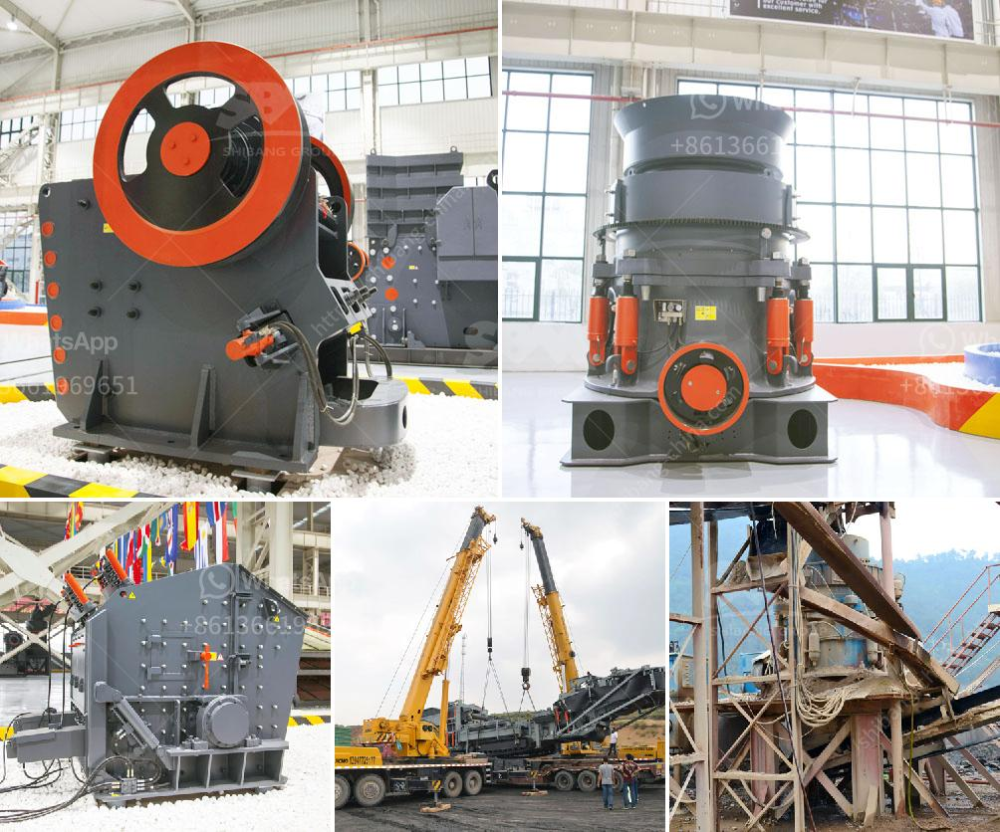

<h3>mobile dolomite impact crusher for hire</h3>
Dolomite is a mineral composed of calcium magnesium carbonate, which is commonly found in sedimentary rocks. Dolomite is known for its use in the construction industry, particularly as a base material for paving stones and asphalt. This mineral is also commonly used in the manufacturing of cement and glass.

To efficiently utilize dolomite, it needs to be processed into small particles. This is where a mobile dolomite impact crusher for hire comes into play. A crushing machine is typically used to obtain the desired particle size in one or more crushing stages. These crushers are highly efficient and can be utilized in both primary and secondary crushing applications.

Mobile dolomite impact crushers are designed to crush materials on site, reducing transport costs and minimizing the environmental impact of the mining activities. These crushers are ideal for crushing medium-hardness materials such as limestone, slag, coke, coal, and other materials in cement, chemical, power, metallurgy and other industries.

A mobile dolomite impact crusher for hire offers an efficient and environmentally friendly way to process dolomite. Delivering a compact, space-saving footprint, the crusher can easily adjust to changing production requirements with its advanced hydraulic control system. Users can easily set the crusher to perform at different capacities, optimizing production and minimizing downtime.

One key advantage of a mobile dolomite impact crusher for hire is its portability and accessibility. It can be quickly transported to different job sites, making it a versatile and cost-effective solution for contractors and quarry operators. The crusher can be easily fitted on a trailer or truck, which simplifies transportation and enables it to be used in remote areas with limited infrastructure.

The mobile dolomite impact crusher is also equipped with a screening system, which allows for integration of a scalper ahead of the crushing chamber. This way, the material can be screened separately before being fed into the crusher. This ensures that the crusher operates at optimum efficiency by preventing oversized materials from entering the crushing chamber.

Another important feature of a mobile dolomite impact crusher for hire is its adaptability to different crushing applications. With an adjustable rotor speed and impact plate configuration, the crusher can be customized to suit specific requirements. This versatility allows for precise control over the final product size and shape, making it suitable for a wide range of applications.

In conclusion, mobile dolomite impact crushers offer a cost-effective and environmentally friendly solution for processing dolomite on site. Their portability, adaptability, and efficiency make them ideal for various industries, including construction, mining, and recycling. By choosing a reliable and efficient crusher, operators can maximize production and minimize downtime, ultimately improving their bottom line.
<h3>Contact us</h3><ul><li><strong>Whatsapp:&nbsp;<a href="https://wa.me/8613661969651">+8613661969651</a></strong></li><li><a href="https://swt.shibang-china.com/?git&amp;zhl&amp;mobile dolomite impact crusher for hire"><strong>Online Service(chat now)</strong></a></li></ul><h3>Related</h3><ul><li><a href='gypsum stone crusher machine.md'>gypsum stone crusher machine</a></li><li><a href='cement ball mill design pdf.md'>cement ball mill design pdf</a></li><li><a href='crushed plant mobile coquimbo.md'>crushed plant mobile coquimbo</a></li><li><a href='concrete stone crusher south africa.md'>concrete stone crusher south africa</a></li><li><a href='stone crusher in spain.md'>stone crusher in spain</a></li></ul>