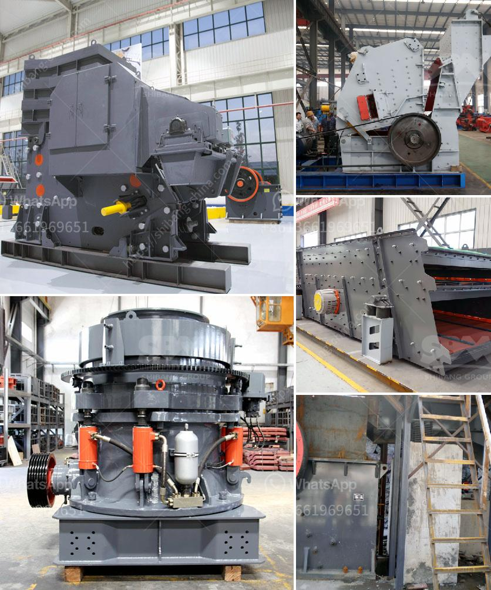

<h3>mobile glass crushing plant</h3>
Glass has been an indispensable part of our lives for centuries. It is used in various applications, from household items to commercial buildings. However, the disposal of glass waste has become a significant environmental challenge. Traditional methods of glass disposal, such as landfilling or incineration, not only contribute to pollution but also waste valuable resources.

To tackle this issue, innovative solutions like mobile glass crushing plants have emerged, emphasizing the importance of recycling and reusing glass waste. These mobile plants are designed to crush glass into small particles, making it easier to transport and recycle. Let us explore the features and benefits of a mobile glass crushing plant.

One of the key advantages of a mobile glass crushing plant is its mobility. Unlike fixed crushing plants, a mobile plant can be easily moved between different sites, allowing for efficient on-site glass recycling. This mobility also reduces transportation costs, as glass waste can be processed close to the source, eliminating the need for long-distance transportation.

Another significant feature of a mobile glass crushing plant is its ability to process a wide range of glass waste. Whether it is bottles, jars, or broken glass from windows, the plant can easily handle various glass types. This versatility ensures that all forms of glass waste can be effectively recycled, minimizing the environmental impact.

The process of glass crushing in these mobile plants is simple yet effective. Glass waste is fed into the primary crusher, where it is shattered into smaller particles. These particles are then conveyed to the secondary crusher for further size reduction. The resulting crushed glass can be reused in various applications, such as aggregate in construction projects, decorative elements, or even as a raw material in glass manufacturing.

Recycling glass waste through a mobile crushing plant has numerous benefits. Firstly, it conserves natural resources by reducing the demand for raw materials used in glass production. By recycling glass waste, we can save energy, water, and reduce greenhouse gas emissions associated with manufacturing new glass products.

Secondly, recycling glass waste contributes to a circular economy. Rather than discarding glass waste into landfills or incineration, which are detrimental to the environment, recycling enables the recovery of valuable materials. These recycled materials can then be reintroduced into the production process, creating a closed-loop system that minimizes waste and maximizes resource efficiency.

Furthermore, mobile glass crushing plants help reduce landfill space. Glass waste occupies significant space in landfills, reducing their capacity and contributing to increased waste disposal costs. By recycling glass waste, we can free up valuable landfill space for other waste streams and reduce the environmental footprint associated with waste management.

In conclusion, mobile glass crushing plants offer a revolutionary solution for glass recycling. These plants combine mobility, versatility, and efficiency to ensure the effective recycling of glass waste. By utilizing mobile plants, we can reduce transportation costs, process various glass types, and contribute to a circular economy. Recycling glass waste not only conserves natural resources but also reduces landfill space and minimizes environmental impact. It's time to embrace the mobile glass crushing technology to create a sustainable future for our planet.
<h3>Contact us</h3><ul><li><strong>Whatsapp:&nbsp;<a href="https://wa.me/8613661969651">+8613661969651</a></strong></li><li><a href="https://swt.shibang-china.com/?git&amp;zhl&amp;mobile glass crushing plant"><strong>Online Service(chat now)</strong></a></li></ul><h3>Related</h3><ul><li><a href='dust reduction system for stone crusher plant.md'>dust reduction system for stone crusher plant</a></li><li><a href='bentonite powder raymond mill.md'>bentonite powder raymond mill</a></li><li><a href='mobile concrete crusher.md'>mobile concrete crusher</a></li><li><a href='quartz powder manufacturers in india.md'>quartz powder manufacturers in india</a></li><li><a href='impact crusher supplier.md'>impact crusher supplier</a></li></ul>