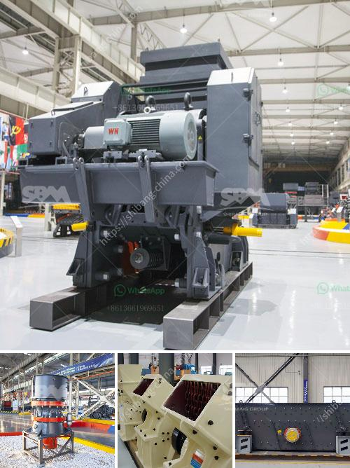

<h3>mobile gold processing plant south africa</h3>
The mobile gold processing plant, a breakthrough of the traditional method of gold extraction, is an important part of mining operations in South Africa. Mobile gold processing plant has advantages of portable operation and low cost compared to traditional methods.

In recent years, the gold mining industry in South Africa has been declining due to a combination of economic factors and dwindling reserves. Traditional gold processing methods, which involve large-scale machinery and extensive infrastructure, have become less viable. This has led to the development of mobile gold processing plants which can be easily transported to remote mining sites.

One of the significant advantages of a mobile gold processing plant is its portability. The plant can be easily transported from one site to another, allowing miners to access remote areas with ease. This means that gold deposits in remote locations are no longer uneconomical to mine. Furthermore, the mobile design also enables fast setup and dismantling, reducing the time required for operations.

Another advantage of mobile gold processing plants is their low cost. Traditional gold processing plants require a significant investment in infrastructure, such as power supply and water management. In contrast, mobile plants are designed to be self-sufficient, with integrated power generation and water treatment systems. This eliminates the need for costly infrastructure and reduces operating expenses significantly.

A mobile gold processing plant typically consists of a jaw crusher, ball mill, and centrifugal gold concentrator, mounted on a trailer or skid. These plants are modular, meaning they can be easily expanded or modified to accommodate changing ore characteristics or processing requirements.

In conclusion, the mobile gold processing plant has revolutionized the gold mining industry in South Africa. Its portability and low cost have made it possible to mine gold in remote locations and extend the life of existing mines. With advancements in technology and the growing need for sustainable and efficient mining practices, mobile gold processing plants are likely to play an even more significant role in the future.
<h3>Contact us</h3><ul><li><strong>Whatsapp:&nbsp;<a href="https://wa.me/8613661969651">+8613661969651</a></strong></li><li><a href="https://swt.shibang-china.com/?git&amp;zhl&amp;mobile gold processing plant south africa"><strong>Online Service(chat now)</strong></a></li></ul><h3>Related</h3><ul><li><a href='sell conveyor belts in south africa.md'>sell conveyor belts in south africa</a></li><li><a href='used screens crushers for coal uk.md'>used screens crushers for coal uk</a></li><li><a href='copper concentrate ball mill for sale.md'>copper concentrate ball mill for sale</a></li><li><a href='powder mill machinery process pdf.md'>powder mill machinery process pdf</a></li><li><a href='impact crusher specification limestone.md'>impact crusher specification limestone</a></li></ul>