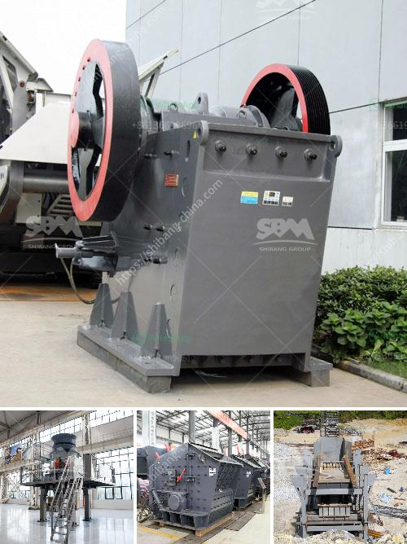

<h3>mobile impact crusher in road construction</h3>
Mobile impact crusher is a versatile, compact and efficient machine that is commonly used in road construction. This machine ensures the crushing of the aggregate materials and significantly reduces the costs associated with the transportation of waste materials to landfill sites. The utilization of the mobile impact crusher in road construction is gaining immense popularity due to its incredible flexibility.

The mobile impact crusher is a track-mounted machine that is easily transportable and can be deployed on the road as and when required. The ability to handle different types of materials efficiently and with ease allows contractors to take on more projects on the go. Whether it is recycling concrete, asphalt, or bricks, the mobile impact crusher can crush them all into specified sizes, making it suitable for a wide range of road construction applications.

One of the key advantages of using a mobile impact crusher in road construction is its low operating cost. Due to its compact design and highly efficient operation, the machine requires less energy to crush the materials. This translates into significant savings on fuel consumption and energy costs. Additionally, the mobile impact crusher reduces the need for expensive transportation of materials to and from the job site, as it can be easily moved wherever needed.

Another major advantage of using the mobile impact crusher in road construction is its ability to produce a well-graded and cubical end product. The machine is equipped with an advanced impact chamber that produces high-quality aggregates. This ensures better compaction and durability of the road surface. The consistent particle size distribution also enhances the overall performance and longevity of the road.

In conclusion, the mobile impact crusher has revolutionized the way road construction projects are carried out. Its ability to handle different materials, low operating cost, and production of high-quality aggregates make it an essential equipment in modern road construction. Contractors can now complete their projects faster, save costs, and achieve better road quality with the help of this versatile machine.
<h3>Contact us</h3><ul><li><strong>Whatsapp:&nbsp;<a href="https://wa.me/8613661969651">+8613661969651</a></strong></li><li><a href="https://swt.shibang-china.com/?git&amp;zhl&amp;mobile impact crusher in road construction"><strong>Online Service(chat now)</strong></a></li></ul><h3>Related</h3><ul><li><a href='double toggle jaw crushers.md'>double toggle jaw crushers</a></li><li><a href='puzzolana tph cone crusher plant prices.md'>puzzolana tph cone crusher plant prices</a></li><li><a href='quartz stone making process.md'>quartz stone making process</a></li><li><a href='mobile recycle crushing.md'>mobile recycle crushing</a></li><li><a href='cost of limestone powder crushing machine.md'>cost of limestone powder crushing machine</a></li></ul>