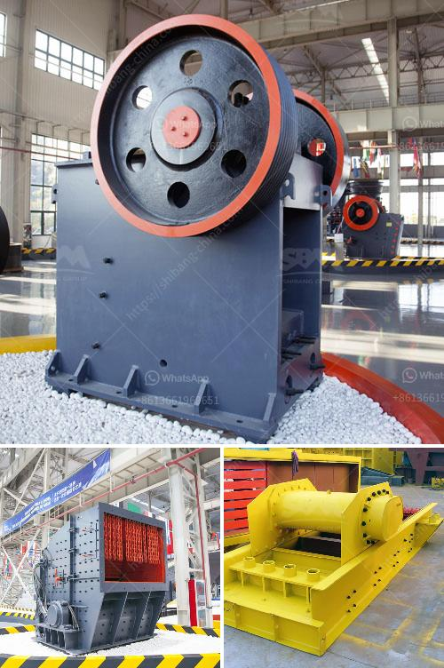

<h3>mobile jaw crusher for sale</h3>
Mobile jaw crushers are becoming a popular choice for processing materials in mining and quarrying applications due to their efficient and versatile capabilities. The emergence of mobile jaw crushers has brought significant benefits to the construction and demolition waste recycling industry as well.

A mobile jaw crusher is designed to crush materials on site, which means it can be easily moved when necessary. This machine is also compact in size and easy to transport, making it the perfect solution for any mobile crushing operation. Whether you're looking to recycle concrete, rock, or any other construction debris, a mobile jaw crusher can quickly process these materials into a usable and saleable product.

One of the main advantages of a mobile jaw crusher is its ability to crush materials directly on site, eliminating the need for cumbersome and costly transportation. This also means that there is less reliance on expensive aggregates and reduces the need for additional equipment, such as excavators and loaders. A mobile jaw crusher can handle a wide range of applications and materials, making it highly versatile for various recycling and quarrying applications.

When searching for a mobile jaw crusher for sale, you need to ensure that the machine meets all your requirements. The machine's capacity, power, fuel efficiency, and other specifications need to be considered to ensure that it can deliver the desired performance. Additionally, it's essential to choose a reputable manufacturer that can provide after-sales support, spare parts, and maintenance services.

In conclusion, a mobile jaw crusher is a valuable investment for any construction or mining company, enabling them to process waste materials on site, thus saving on transportation costs and generating additional revenue by producing a saleable product. With the right machine and a reputable manufacturer, mobile jaw crushers offer a reliable and cost-effective solution for crushing operations.
<h3>Contact us</h3><ul><li><strong>Whatsapp:&nbsp;<a href="https://wa.me/8613661969651">+8613661969651</a></strong></li><li><a href="https://swt.shibang-china.com/?git&amp;zhl&amp;mobile jaw crusher for sale"><strong>Online Service(chat now)</strong></a></li></ul><h3>Related</h3><ul><li><a href='gemstone mining and processing machine.md'>gemstone mining and processing machine</a></li><li><a href='roller mill nigeria.md'>roller mill nigeria</a></li><li><a href='grinding mill machine cost price south africa.md'>grinding mill machine cost price south africa</a></li><li><a href='marble grinding mill process.md'>marble grinding mill process</a></li><li><a href='used big mobile jaw crusher in dubai.md'>used big mobile jaw crusher in dubai</a></li></ul>