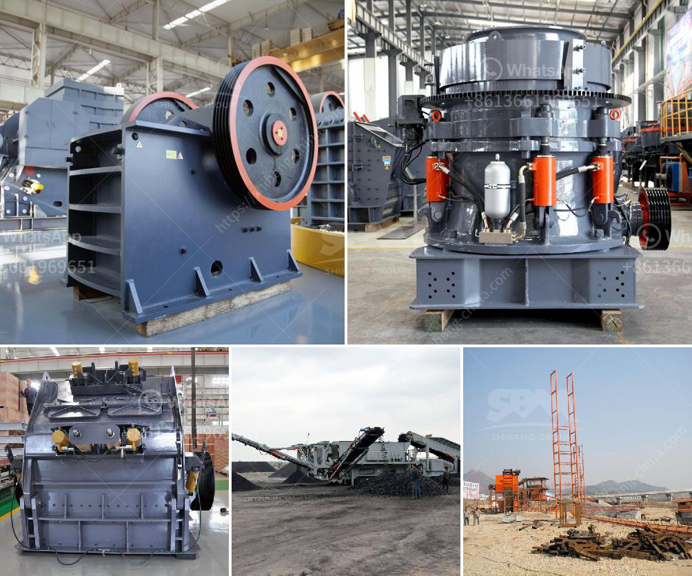

<h3>mobile jaw crusher tons per hour</h3>
The mobile jaw crusher has a feed opening of 1,200mm x 800mm. The crushing chamber has a large feed opening of 800mm x 500mm, which can process large materials with a maximum feed size of 600mm. With a dynamic adjustment system, the jaw crusher can easily adjust the size of the crushed material to fulfill different specifications.

The mobile jaw crusher is ideal for primary crushing. It can process various hard and abrasive materials, such as granite, basalt, gravel, and concrete, and can crush materials with a compressive strength of up to 320MPa.

With its high crushing capacity, the mobile jaw crusher can crush materials at a rate of up to 500 tons per hour. The materials will be evenly processed by the vibrating feeder, conveyed to the jaw crusher for primary crushing, and then conveyed to the vibrating screen for screening. The screened materials will be conveyed to the storage pile by the belt conveyor.

The high crushing efficiency of the mobile jaw crusher is achieved through its optimized design and high-quality materials. The oversized material can be separated and removed by the vibrating screen during the crushing process, ensuring the quality of the final product.

In addition, the mobile jaw crusher is equipped with a reliable and efficient diesel engine, which can provide a continuous power supply for the crusher. This eliminates the need for external power sources, making it suitable for remote areas or construction sites without access to electricity.

Furthermore, the mobile jaw crusher is easy to transport and can be quickly set up at the work site. It can be operated by a single person, reducing labor costs and improving work efficiency. The compact design of the mobile jaw crusher also allows it to be used in narrow spaces, making it an ideal choice for various construction projects.

Whether it is used for construction waste recycling or hard rock crushing, the mobile jaw crusher has proven its reliability and productivity. Its ability to process large materials and high crushing capacity make it an essential equipment in various industries.

In conclusion, the mobile jaw crusher is a high-quality crushing equipment with a high crushing efficiency and a large capacity. It can crush materials at a rate of up to 500 tons per hour, making it a reliable choice for primary crushing at construction sites or mining operations. Its compact design and easy transportation make it a versatile and efficient solution for various crushing applications.
<h3>Contact us</h3><ul><li><strong>Whatsapp:&nbsp;<a href="https://wa.me/8613661969651">+8613661969651</a></strong></li><li><a href="https://swt.shibang-china.com/?git&amp;zhl&amp;mobile jaw crusher tons per hour"><strong>Online Service(chat now)</strong></a></li></ul><h3>Related</h3><ul><li><a href='jual stone crusher merk.md'>jual stone crusher merk</a></li><li><a href='potassium ore production equipment.md'>potassium ore production equipment</a></li><li><a href='crusher and screening plant price south africa.md'>crusher and screening plant price south africa</a></li><li><a href='roller crusher in egypt.md'>roller crusher in egypt</a></li><li><a href='crushing companies in the usa.md'>crushing companies in the usa</a></li></ul>