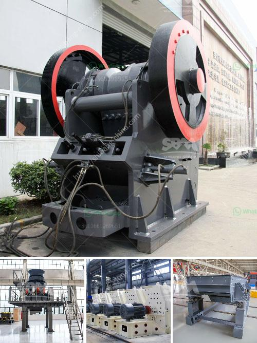

<h3>mobile recycle crushing</h3>
In recent years, sustainability has become a pressing concern across various industries, including construction. As the world grapples with the mounting environmental issues, it is crucial to adopt eco-friendly practices in every facet of our lives. Mobile recycle crushing has emerged as a game-changing solution for construction sites, paving the way toward a greener and more sustainable future.

Construction projects generate colossal amounts of waste, ranging from concrete and asphalt to bricks and old structures. Traditionally, the demolition waste would be hauled away to landfills, contributing to environmental degradation and escalating disposal costs. However, mobile recycle crushing has revolutionized the recycling process, allowing construction sites to become more sustainable and economically viable.

Mobile recycling crushing involves the use of portable crushing plants, specifically designed to crush and screen construction waste on-site. These mobile units employ advanced technologies, such as jaw crushers, impact crushers, and vibrating screens, enabling efficient and effective recycling of various materials. The process begins with the collection of the construction waste, which is then transported to the crushing plant using trucks or loaders.

Once at the site, the waste is fed into the jaw crusher, where it is broken down into smaller pieces. The crushed material is then conveyed to the vibrating screen, which separates it into different sizes and eliminates any impurities or contaminants. The final product, known as recycled aggregate, can be reused in numerous construction applications, such as road and building foundations, drainage systems, and landscaping.

Implementing mobile recycle crushing offers a plethora of benefits. Firstly, it significantly reduces the environmental impact of construction activities. By transforming waste into usable recycled aggregate, precious natural resources like gravel and sand can be conserved. Additionally, the reduced transport of waste to landfills minimizes carbon emissions and decreases the strain on finite disposal sites.

Moreover, mobile recycle crushing cuts down on the need for new construction materials, resulting in substantial cost savings. Since recycled aggregate can be used in place of traditional materials, expenses associated with purchasing, transporting, and storing them are reduced. Construction companies can redirect these savings toward other aspects of the project, providing a competitive advantage in the industry.

Furthermore, mobile recycle crushing promotes a circular economy, fostering opportunities for the creation of new businesses and jobs in the recycling sector. Recyclers can process the waste materials and sell the recycled aggregate to construction companies, thereby closing the loop and driving economic growth. This stimulates local economies while simultaneously reducing the reliance on importing construction materials.

Nevertheless, mobile recycle crushing does face certain challenges that need to be addressed. One such challenge is the need for proper sorting and separation of different types of waste at the construction site. Ensuring that only suitable materials are fed into the crushing plant is crucial to producing high-quality recycled aggregate. Additionally, raising awareness among construction workers about the importance of waste segregation is vital, as it can influence the success and efficiency of the recycling process.

In conclusion, mobile recycle crushing presents a sustainable solution for construction sites, offering a range of environmental, economic, and societal benefits. By diverting construction waste from landfills and converting it into reusable recycled aggregate, we can reduce the strain on natural resources, cut greenhouse gas emissions, and drive economic growth. Mobile recycle crushing is a step toward a circular economy and a brighter, greener future for the construction industry.
<h3>Contact us</h3><ul><li><strong>Whatsapp:&nbsp;<a href="https://wa.me/8613661969651">+8613661969651</a></strong></li><li><a href="https://swt.shibang-china.com/?git&amp;zhl&amp;mobile recycle crushing"><strong>Online Service(chat now)</strong></a></li></ul><h3>Related</h3><ul><li><a href='gold hammer mills for sale south africa.md'>gold hammer mills for sale south africa</a></li><li><a href='micro fine grinding mill morrison.md'>micro fine grinding mill morrison</a></li><li><a href='what is the best granite crusher machine.md'>what is the best granite crusher machine</a></li><li><a href='stone crusher machinery turkey.md'>stone crusher machinery turkey</a></li><li><a href='stone crusher details.md'>stone crusher details</a></li></ul>