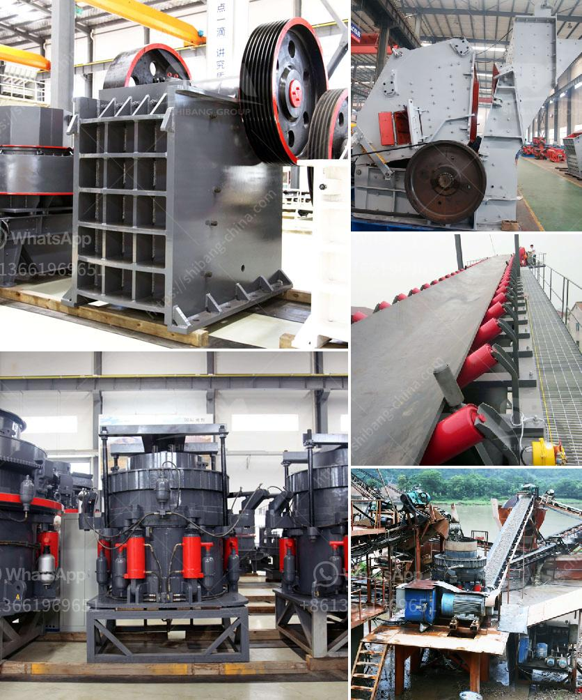

<h3>mobile screening plant</h3>
Mobile screening plants are an essential component in the mining and construction industries. They are designed to efficiently separate different sizes of materials, such as rocks, gravel, and sand, making them suitable for a wide range of applications.

One of the main advantages of mobile screening plants is their versatility and mobility. Unlike static screening plants, which are fixed in one location, mobile units can be easily transported from one site to another. This flexibility allows companies to quickly set up and dismantle the screening plants, saving time and reducing costs.

Another key feature of mobile screening plants is their high processing capacity. These plants are equipped with powerful screens that can efficiently process large quantities of material. They can effectively separate different particle sizes, ensuring that only the desired materials are used for further processing. This enhances productivity and reduces waste, making mobile screening plants cost-effective solutions for various industries.

In addition to their high processing capacity, mobile screening plants are also known for their energy efficiency. Many modern models are equipped with advanced technologies, such as hybrid or electric engines, which reduce fuel consumption and minimize emissions. This not only helps to protect the environment but also lowers operating costs for companies.

Moreover, mobile screening plants are designed to withstand harsh conditions in the field. They are built with sturdy materials and feature robust structures to ensure durability and reliability. This means that they can continue to operate efficiently even in challenging environments, maximizing uptime and minimizing downtime.

Overall, mobile screening plants are essential machines for industries that require efficient and versatile material separation. Their mobility, high processing capacity, energy efficiency, and durability make them valuable assets for mining and construction companies. With their ability to adapt to different sites and efficiently process various materials, mobile screening plants contribute to increased productivity, reduced waste, and overall cost savings.
<h3>Contact us</h3><ul><li><strong>Whatsapp:&nbsp;<a href="https://wa.me/8613661969651">+8613661969651</a></strong></li><li><a href="https://swt.shibang-china.com/?git&amp;zhl&amp;mobile screening plant"><strong>Online Service(chat now)</strong></a></li></ul><h3>Related</h3><ul><li><a href='small scale mining project proposal.md'>small scale mining project proposal</a></li><li><a href='grinding of calcined gypsum.md'>grinding of calcined gypsum</a></li><li><a href='crusher conica crusher ethiopia.md'>crusher conica crusher ethiopia</a></li><li><a href='price of aggregate crusher machine in ethiopia.md'>price of aggregate crusher machine in ethiopia</a></li><li><a href='quartz plant and machinary.md'>quartz plant and machinary</a></li></ul>