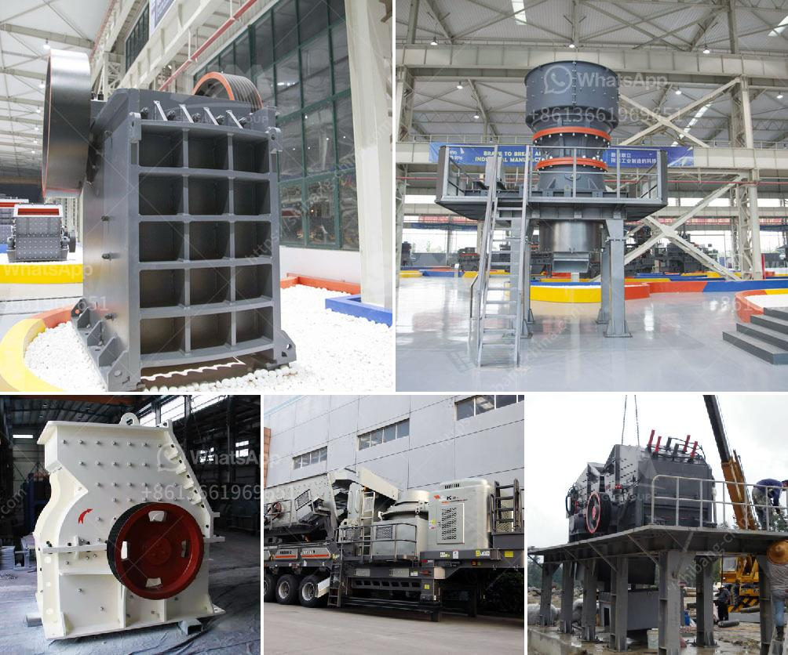

<h3>mobile stone crusher in saudi</h3>
The mobile stone crusher in Saudi Arabia has greatly expanded the concept of coarse crushing, which greatly increases the application range of the equipment and can meet the requirements of different users. The mobile stone crusher can be operated independently or in conjunction with other devices in accordance with different requirements. It provides a new field of business opportunities for contractors, quarry operators, recycling and mining applications.

One of the biggest advantages of mobile stone crusher is easy to move, highly flexible, and the equipment can save a lot of infrastructure and relocation costs. The material can be broken on site and transported away as the need arises, which greatly reduces transportation costs. In addition, the combination of the mobile stone crusher and the vibrating screen can effectively separate and crush the materials, improving the production efficiency.

The mobile stone crusher in Saudi Arabia can be equipped with jaw crusher, impact crusher, cone crusher, gyratory crusher, and vibrating screen etc. It can be applied in primary, secondary or tertiary crushing applications. The mobile stone crusher also provides higher crushing efficiency and low cost per tonne production compared to traditional stone crushers.

The mobile stone crusher in Saudi Arabia has the advantage of reasonable matching, unobstructed discharge all line, reliable working, convenient operation, high efficiency and saving energy. Especially the mobility is very good, so it can extend with the raw material places or the construction place, and it can also make multiple matching, get to different product requirements. Once the materials are processed into smaller particles, they will be used in different industries. Whether it is a construction site, a mining quarry, or a wood processing plant, the mobile stone crusher in Saudi Arabia can achieve excellent production and efficiency. Overall, the mobile stone crusher in Saudi Arabia is hot selling and highly versatile. Its advanced design, excellent performance, and high efficiency have been well received by local users.
<h3>Contact us</h3><ul><li><strong>Whatsapp:&nbsp;<a href="https://wa.me/8613661969651">+8613661969651</a></strong></li><li><a href="https://swt.shibang-china.com/?git&amp;zhl&amp;mobile stone crusher in saudi"><strong>Online Service(chat now)</strong></a></li></ul><h3>Related</h3><ul><li><a href='powder ball milling machines.md'>powder ball milling machines</a></li><li><a href='cement process making in philippines.md'>cement process making in philippines</a></li><li><a href='distributor belt conveyor di philippines.md'>distributor belt conveyor di philippines</a></li><li><a href='gravel and sand mining equipment.md'>gravel and sand mining equipment</a></li><li><a href='grinding equipment raymond mill.md'>grinding equipment raymond mill</a></li></ul>