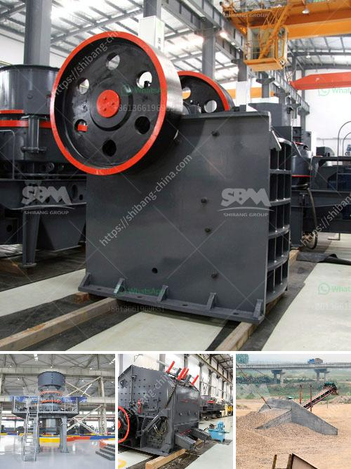

<h3>mobile stone crusher price philippines</h3>
The Philippines is predominantly a mineral-rich country with an estimated 30 trillion worth of mineral reserves. With its numerous mining sites, it has become a prime destination for companies engaged in mining activities. The mining industry has contributed significantly to the country's economic growth and job creation. Mobile stone crushers are vital equipment used in major mining operations.

In recent years, the Philippine government has been promoting infrastructure development to support the country's economic growth. As a result, the demand for stone crushers has increased significantly. The Philippines is also a popular tourist destination, attracting millions of visitors each year. The construction and maintenance of these tourist facilities further amplify the need for mobile stone crushers.

The price of mobile stone crushers in the Philippines depends on the model, size, and capacity. Costs associated with the equipment also vary, ranging from low to high.

1. Type of stone crusher: Different stone crushers have different prices since their technologies are also different. For instance, a jaw crusher has a different mechanism compared to a gyratory crusher.

2. Size and capacity: Different stone crushers have different sizes and capacities. A larger stone crusher with higher capacity comes at a higher price due to higher production capability.

3. Brand and reputation: Established brands with reliable and efficient stone crushers often command a higher price due to their reputation and performance.

4. Maintenance and spare parts: Mobile stone crushers require regular maintenance and sometimes need spare parts. The availability and cost of maintenance services and spare parts can also influence its price.

1. Mobility: The primary advantage of a mobile stone crusher is its ability to move from one location to another easily. This feature allows operators to transport the equipment to different mining sites, maximizing efficiency and reducing transportation costs.

2. Flexibility: Mobile stone crushers can be used in various mining operations, providing flexibility in terms of applications. They can crush different types of stones and rocks, making them versatile in different quarrying activities.

3. Efficiency: Mobile stone crushers are known for their high production capacity and efficient crushing capabilities. They can process large volumes of materials quickly, allowing for faster completion of mining projects.

The mobile stone crusher industry in the Philippines plays a crucial role in maintaining the country's prosperity. To meet the increasing demands for aggregate materials for infrastructure development, the use of mobile stone crushers has gradually become widespread. With the flexibility, mobility, and efficiency they offer, these crushers contribute significantly to the success of various mining and quarrying operations.

As demand for mobile stone crushers continues to rise, the prices of these equipment may vary depending on various factors. Understanding the differences in size, capacity, brand, and maintenance requirements is essential for buyers to make informed decisions when purchasing these machines. 

With the proper utilization of mobile stone crushers, the Philippine quarrying industry can continue to unlock its vast potential and contribute to the country's economic growth and development.
<h3>Contact us</h3><ul><li><strong>Whatsapp:&nbsp;<a href="https://wa.me/8613661969651">+8613661969651</a></strong></li><li><a href="https://swt.shibang-china.com/?git&amp;zhl&amp;mobile stone crusher price philippines"><strong>Online Service(chat now)</strong></a></li></ul><h3>Related</h3><ul><li><a href='clay crusher machine in india.md'>clay crusher machine in india</a></li><li><a href='rejection coal mills with double seal.md'>rejection coal mills with double seal</a></li><li><a href='germany rocks crushers.md'>germany rocks crushers</a></li><li><a href='ball mill india suppliers.md'>ball mill india suppliers</a></li><li><a href='wet process cement.md'>wet process cement</a></li></ul>