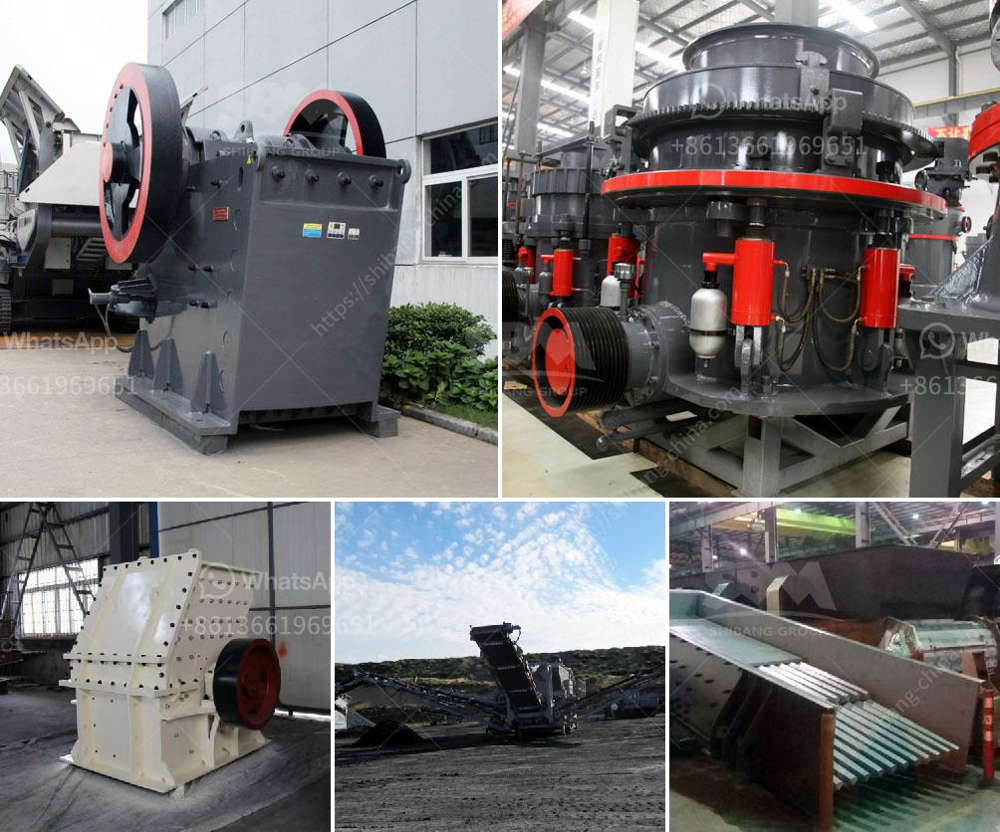

<h3>mobile used crushing and screening plant for sale</h3>
Crushing and screening plant is widely used in various industries such as mining, building materials, metallurgy, highways, railways, water conservancy, chemical industry, and more. It can crush large materials, making them smaller and more manageable, and can also screen out different sizes of stones for further processing or for final use. Mobile used crushing and screening plants are the perfect choice for efficient and versatile screening and crushing operations.

One of the main advantages of mobile used crushing and screening plants is their ability to be easily transported between work sites, which allows operators to take advantage of different locations and jobsites. This is especially beneficial for construction projects that require crushing and screening of materials on-site. With mobile plants, materials can be processed directly at the site, reducing transportation costs and time.

Another advantage of mobile used crushing and screening plants is their flexibility and customizable options. These plants come in various sizes and configurations to cater to different needs and requirements. From small-scale crushing plants suitable for urban construction projects to large-scale plants for mining operations, there is a wide range of options available. These plants can be equipped with different crushers and screens to meet specific production goals and output requirements.

Furthermore, mobile used crushing and screening plants are designed to be user-friendly and easy to operate. They come with advanced control systems that allow operators to monitor and control the entire process. Some plants even have remote control capabilities, enabling operators to control the plant from a distance. This not only improves safety but also enhances productivity and efficiency.

Additionally, mobile used crushing and screening plants are eco-friendly and energy-efficient. Many plants are equipped with advanced technologies and features that reduce environmental impact. For example, some plants use diesel-electric hybrid engines, which significantly reduce fuel consumption and emissions. This is not only beneficial for the environment but also helps reduce operating costs.

When looking for a mobile used crushing and screening plant for sale, there are several factors to consider. First, it is important to assess the specific needs and requirements of the project. This includes determining the type of material to be processed, required output size, and production capacity. Additionally, it is essential to consider the condition and maintenance history of the plant, as well as the reputation and reliability of the manufacturer or seller.

In conclusion, mobile used crushing and screening plants offer a convenient and efficient solution for various industries. Their ability to be easily transported, flexibility, customizable options, user-friendly operation, and eco-friendly features make them highly desirable. Whether for construction projects, mining operations, or other applications, mobile used crushing and screening plants provide a cost-effective and reliable solution. With careful consideration of specific needs and careful evaluation of available options, finding the right plant for sale is achievable.
<h3>Contact us</h3><ul><li><strong>Whatsapp:&nbsp;<a href="https://wa.me/8613661969651">+8613661969651</a></strong></li><li><a href="https://swt.shibang-china.com/?git&amp;zhl&amp;mobile used crushing and screening plant for sale"><strong>Online Service(chat now)</strong></a></li></ul><h3>Related</h3><ul><li><a href='stone crusher in himachal pradesh.md'>stone crusher in himachal pradesh</a></li><li><a href='slag crushing plant manufacturers in india.md'>slag crushing plant manufacturers in india</a></li><li><a href='course in maintenance of stone crushers.md'>course in maintenance of stone crushers</a></li><li><a href='coal grinding machinery manufacture in india.md'>coal grinding machinery manufacture in india</a></li><li><a href='roll crusher used equipment tph coal russian.md'>roll crusher used equipment tph coal russian</a></li></ul>