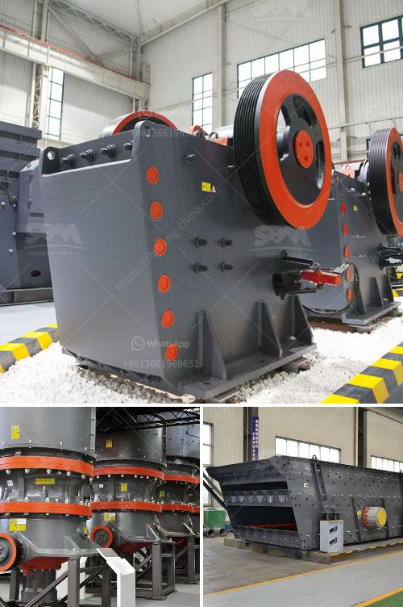

<h3>modular jaw crusher</h3>
A modular jaw crusher is a highly efficient and flexible piece of equipment used in a wide range of industries. It facilitates simplicity, safety, and convenience in the crushing process by integrating various components into one machine.

The modular jaw crusher is designed for different industries, and it is very suitable for large-scale mining sites, quarries, and industrial recycling facilities, as well as construction waste disposal areas. It can crush various materials, including granite, limestone, concrete, and river pebbles. With a 300-500mm feed size, such a machine is a practical choice for many crushing applications.

One key advantage of a modular jaw crusher is its ability to be easily transported and relocated to different job sites. This is especially important for companies that need to move their crushing operations frequently. The machine can be dismantled into smaller parts, making it easier to transport and set up in a new location. Additionally, it can be quickly assembled and disassembled by only a few workers, saving time and labor costs.

Another feature of a modular jaw crusher is its modular design. The machine consists of several independent modules that can be combined and configured according to specific requirements. These modules can include a primary jaw crusher, secondary or tertiary cone crusher, and a vibrating screen module. Each module is equipped with its own electric motor and power control panel, which ensures efficient operation and easy maintenance.

The modular design also allows for the customization of the machine. Depending on the application and material requirements, different modules can be added or removed. This flexibility enables the machine to adapt to different crushing tasks and produce various sizes of aggregates. It also allows for future upgrades or expansion of the crushing circuit as needed.

Safety is a paramount concern in any crushing operation, and a modular jaw crusher is designed with this in mind. The machine is equipped with a variety of safety features, such as emergency stop buttons, overload protection, and a hydraulic system that prevents damage to the crusher in case of blockage or other issues. The machine is also designed with easy access for maintenance and repairs, reducing downtime and ensuring efficient operation.

In conclusion, a modular jaw crusher is a versatile and efficient machine that offers numerous benefits to operators in different industries. Its ability to be easily transported and relocated, along with its modular design and safety features, make it an ideal choice for companies that need a flexible crushing solution. Furthermore, its ability to crush a wide range of materials and customize the crushing circuit according to specific requirements ensures high productivity and cost-effectiveness. Whether for mining, quarrying, recycling, or construction waste management, a modular jaw crusher is a valuable asset that can greatly improve crushing operations.
<h3>Contact us</h3><ul><li><strong>Whatsapp:&nbsp;<a href="https://wa.me/8613661969651">+8613661969651</a></strong></li><li><a href="https://swt.shibang-china.com/?git&amp;zhl&amp;modular jaw crusher"><strong>Online Service(chat now)</strong></a></li></ul><h3>Related</h3><ul><li><a href='crushed stone prices per ton.md'>crushed stone prices per ton</a></li><li><a href='price of stone crusher in philippines.md'>price of stone crusher in philippines</a></li><li><a href='concrete grinding machine rental hk.md'>concrete grinding machine rental hk</a></li><li><a href='stone crushers turkey.md'>stone crushers turkey</a></li><li><a href='dolomite crusher manufacture plant.md'>dolomite crusher manufacture plant</a></li></ul>