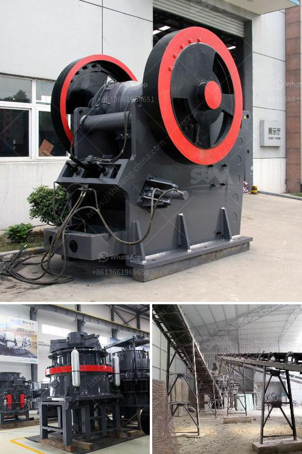

<h3>new mini portable rock impact crusher</h3>
Title: Introducing the New Mini Portable Rock Impact Crusher: Your Ultimate On-the-Go Crushing Solution

The quarrying, mining, and construction industry constantly face a multitude of challenges when it comes to breaking down rocks and stones of various sizes. Finding a portable, efficient, and reliable crushing solution is crucial. In response to this demand, a game-changing innovation has hit the market – the new mini portable rock impact crusher.

The new mini portable rock impact crusher revolutionizes the way stones and rocks are crushed, as it combines mobility, high capacity, and flexibility all in one application. Its mobility allows operators to take the crusher to wherever they are, which ensures high levels of productivity and efficiency. Additionally, the compact nature of this crusher allows for easy transportation and storage.

1. Enhanced Crushing Capability: The mini portable rock impact crusher has several crushing modes, which makes it possible to crush materials in different ways. These modes deliver unique advantages, catering to a variety of job requirements.

2. High Efficiency: Equipped with advanced technology, this rock impact crusher enhances productivity and ensures outstanding performance. It efficiently breaks down rocks, providing a consistent and high-quality end product.

3. Cost-Effective Solution: By eliminating the need for transportation of material to a static crusher, jobsites can save on fuel costs and reduce downtime. The mini portable rock impact crusher efficiently processes waste and recycled materials, while minimizing waste production.

4. Easy Operation and Maintenance: Designed with user-friendly features, the mini portable rock impact crusher ensures smooth operation for all users. This includes remote control operation for added convenience and a compact crusher design that allows for easy maintenance.

This mini portable rock impact crusher is ideal for any small, medium, or large-scale crushing project. It can crush rocks and construction materials of all types. The mobility and portability of this machine make it ideal for working in confined spaces, ensuring maximum flexibility and eliminating the need for additional crushing equipment.

In conclusion, the new mini portable rock impact crusher revolutionizes the crushing industry, allowing operators to increase efficiency and productivity by taking the crusher directly to the rocks. This innovative solution saves time and significantly reduces the cost of transportation, making it an ideal choice for any quarrying, mining, or construction project. With its compact design and versatile capabilities, the mini portable rock impact crusher is indeed a game-changer in the field of crushing equipment.
<h3>Contact us</h3><ul><li><strong>Whatsapp:&nbsp;<a href="https://wa.me/8613661969651">+8613661969651</a></strong></li><li><a href="https://swt.shibang-china.com/?git&amp;zhl&amp;new mini portable rock impact crusher"><strong>Online Service(chat now)</strong></a></li></ul><h3>Related</h3><ul><li><a href='stone crusher gangs in jamaica.md'>stone crusher gangs in jamaica</a></li><li><a href='suppliers of chromite sand from south africa.md'>suppliers of chromite sand from south africa</a></li><li><a href='dust reduction system for stone crusher plant.md'>dust reduction system for stone crusher plant</a></li><li><a href='crushing plant zenith.md'>crushing plant zenith</a></li><li><a href='used quarry crusher machine germany.md'>used quarry crusher machine germany</a></li></ul>