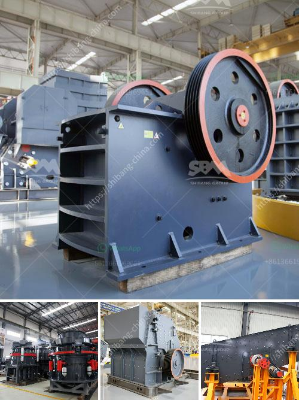

<h3>new ready mix crusher setup plan</h3>
The construction industry is constantly evolving, with new technologies and advancements being introduced to improve efficiency and productivity. One such innovation is the new ready mix crusher setup plan, which promises to streamline the process of producing ready-mixed concrete.

Traditionally, construction companies had to rely on complex and time-consuming methods to obtain ready-mixed concrete. They would need separate facilities for batching the raw materials, such as cement, aggregates, and water, and then transporting them to the site for mixing and use. This often led to delays, increased costs, and a significant waste of resources.

However, with the new ready mix crusher setup plan, all these challenges can now be overcome. This innovative system incorporates a crusher into the concrete batching plant itself, allowing construction companies to produce ready-mixed concrete on-site, eliminating the need for transportation and handling of separate materials.

The benefits of this setup plan are numerous. Firstly, it significantly reduces the time and effort required for the construction process. Construction workers can now access ready-mixed concrete instantly, saving precious hours that can be utilized in other critical tasks.

Secondly, this new setup plan minimizes waste generation. By having a crusher within the batching plant, any excess or leftover concrete can be recycled immediately. This sustainable approach helps conserve resources and reduce environmental impacts.

Thirdly, the new setup plan improves cost-effectiveness. With on-site production of ready-mixed concrete, construction companies can avoid unnecessary logistical expenses, transportation costs, and potential delays due to external suppliers. This efficient and self-reliant approach can lead to substantial cost savings over time.

Lastly, the new ready mix crusher setup plan boosts flexibility. Construction projects often demand different types of concrete mixtures and quantities. By having an on-site crusher, companies have greater control over the mix design, allowing them to adjust and adapt to project requirements swiftly.

In conclusion, the new ready mix crusher setup plan is a game-changer for the construction industry. Its integration of a crusher within the batching plant simplifies and revolutionizes the process of producing ready-mixed concrete, resulting in improved efficiency, reduced waste generation, and enhanced cost-effectiveness. Construction companies that embrace this innovation will undoubtedly gain a competitive edge in the market, delivering projects with greater speed, sustainability, and flexibility.
<h3>Contact us</h3><ul><li><strong>Whatsapp:&nbsp;<a href="https://wa.me/8613661969651">+8613661969651</a></strong></li><li><a href="https://swt.shibang-china.com/?git&amp;zhl&amp;new ready mix crusher setup plan"><strong>Online Service(chat now)</strong></a></li></ul><h3>Related</h3><ul><li><a href='granite edge cutting machine in sweden.md'>granite edge cutting machine in sweden</a></li><li><a href='rental crusher vertical.md'>rental crusher vertical</a></li><li><a href='production process of cement.md'>production process of cement</a></li><li><a href='sand making machine zenith.md'>sand making machine zenith</a></li><li><a href='gold hammer mill.md'>gold hammer mill</a></li></ul>