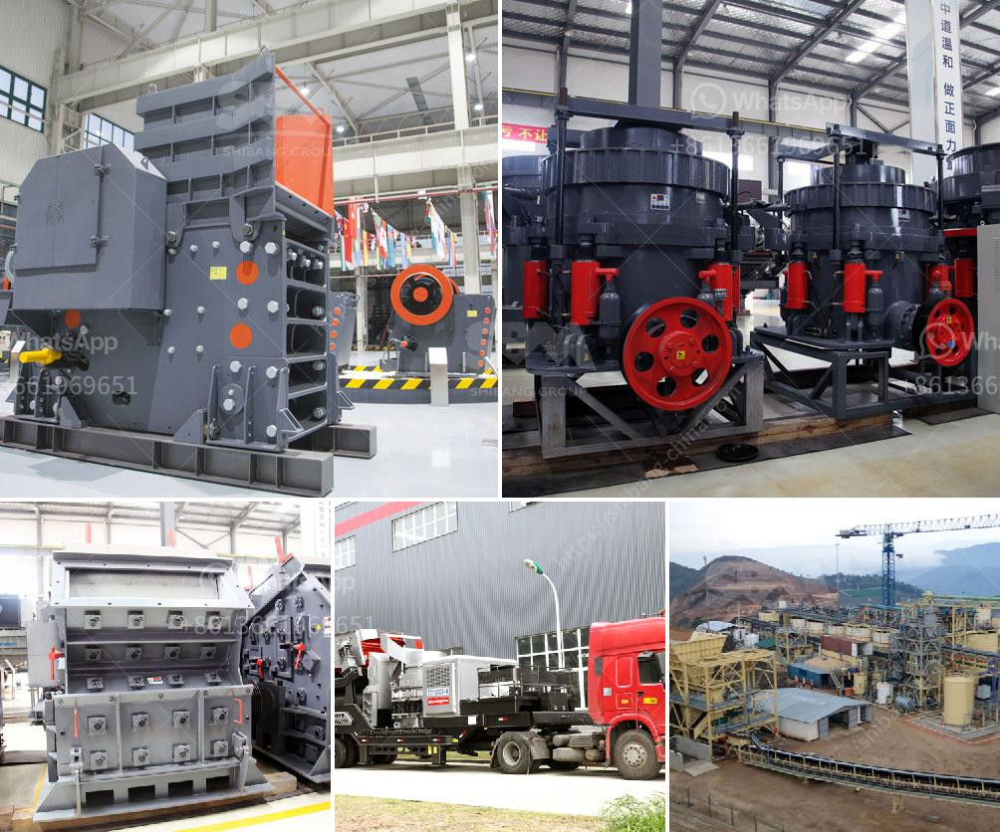

<h3>nigeria cone crusher</h3>
Nigeria is known for its abundant mineral resources, which have been largely untapped due to a lack of modern technologies in mining. The 21st century has, however, witnessed a significant increase in the utilization of these resources, thanks to the introduction of efficient mining machinery, such as the cone crusher.

The cone crusher is a vital machinery tool in large-scale mining industries, particularly in the mineral processing industry. Over the years, it has been proven to be an essential addition to the crushing circuit for countless mining operations.

Cone crushers, also known as conical crushers, break rock between an eccentric rotating head and a bowl. The rotating head is covered by a mantle, which is capable of wearing down the rock as it moves closer to the bowl. The rock then falls through the bottom opening, where it is further crushed into smaller pieces.

1. High Crushing Efficiency: Cone crushers are designed to provide maximum crushing force while maintaining high operational efficiency, offering significantly higher productivity compared to traditional crushers.

2. Versatility: Cone crushers can handle various materials, including granite, limestone, iron ore, and other minerals. This adaptability makes them suitable for a wide range of applications in the mining industry.

3. Enhanced Safety: Cone crushers are equipped with various safety features to protect both workers and the machinery, including hydraulic tramp release systems and clearing chambers. These safety mechanisms minimize downtime and reduce the risk of accidents.

4. Easy Maintenance: Cone crushers are designed with simplified maintenance in mind, making them easier to service and reducing the need for specialized tools. Regular maintenance ensures optimal performance and prolongs the lifespan of the machinery.

Cone crushers are widely used in Nigeria's mining industry, primarily in the quarrying, mining, and aggregate industries. Cone crushers help increase production output and provide a higher level of quality and consistency in the manufactured products.

Moreover, cone crushers are capable of crushing large rocks and ores into finer particles, which enables easier processing of minerals, further enhancing the efficiency of mineral extraction in Nigeria.

In conclusion, Nigeria's mining industry stands to benefit significantly from the incorporation of cone crushers due to their high efficiency, versatility, enhanced safety features, and ease of maintenance.

With the government's continued efforts in promoting and diversifying the mining sector, cone crushers have the potential to unlock Nigeria's mining potential by increasing production output, improving mineral extraction processes, and contributing to the growth of the economy.

As Nigeria continues to explore its vast mineral resources, investing in cone crushers and other modern mining machinery is crucial, as it will ultimately lead to a more sustainable, efficient, and profitable mining industry.
<h3>Contact us</h3><ul><li><strong>Whatsapp:&nbsp;<a href="https://wa.me/8613661969651">+8613661969651</a></strong></li><li><a href="https://swt.shibang-china.com/?git&amp;zhl&amp;nigeria cone crusher"><strong>Online Service(chat now)</strong></a></li></ul><h3>Related</h3><ul><li><a href='ultra fine grinder mill.md'>ultra fine grinder mill</a></li><li><a href='conveyor belts for shelves.md'>conveyor belts for shelves</a></li><li><a href='by products of copper processing.md'>by products of copper processing</a></li><li><a href='lime powder making.md'>lime powder making</a></li><li><a href='impact crusher for sale saudi.md'>impact crusher for sale saudi</a></li></ul>