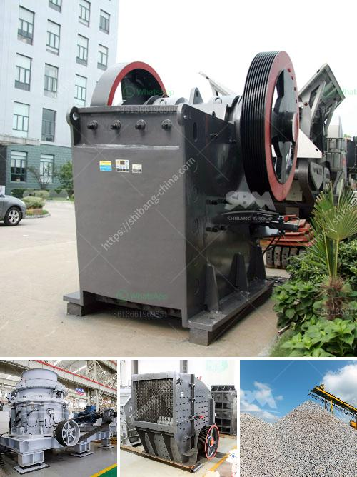

<h3>nigeria crusher suppliers</h3>
With the world's fast-paced urbanization, more and more infrastructure projects are sprouting up in Nigeria. As a result, there is a huge demand for construction aggregate, which can be made from various materials such as limestone, granite, dolomite, and sand. To meet this demand, Nigeria crusher suppliers are becoming increasingly important as they provide reliable, efficient and high quality products.

Nigeria's economy is projected to grow at a CAGR of 2.9% by 2023. This can be attributed to the increasing investment inflow in the mining sector, which in turn stimulates the demand for the extraction and production of mineral resources. Crushers are an essential part of the production process for mineral and aggregate materials.

Crushing is the first step to process minerals and materials. Crushers serve as the main equipment in mining, construction, cement and other related industries, and can be divided into different types, such as jaw crushers, cone crushers, impact crushers, VSI crushers, and more.

Although there are many suppliers of crushers in the market, choosing the right supplier of these machines can be a daunting task. To help you make the right choice, here are some key factors to consider:

1. Reputation and Experience: Look for a supplier with a good reputation in the industry and extensive experience in providing crushers. A supplier that has been in the business for a long time is more likely to offer reliable products and services.

2. Quality and Efficiency: Ensure that the supplier provides crushers that are of high quality and efficient in operation. This will help you achieve maximum productivity and profitability in your operations.

3. After-Sales Service: A good supplier should offer excellent after-sales service, including installation, maintenance, and technical support. This ensures that your equipment operates at its best performance and minimizes downtime.

4. Customization Options: Choose a supplier that can provide customized crushers to meet your specific requirements. This will help optimize your production process and improve overall efficiency.

5. Price and Value for Money: While price is an important consideration, it should not be the sole determining factor. Look for suppliers that offer competitive pricing without compromising on quality.

One of the most important items of equipment for processing limestone in Nigeria is the crusher. This equipment is used to crush large chunks of limestone into smaller pieces. Crushers are widely used in construction, mining, and quarrying industry in Nigeria.

In general, crushers are used to process raw materials in primary crushing stages; and are often utilized in secondary crushing stages as well. One of the leading suppliers of crushers in Nigeria is SBM. They offer a comprehensive range of crushers for various industries and applications.

Nigeria's growing economy and the rapid urbanization of cities are contributing to the increasing demand for construction aggregate. As a result, Nigeria crusher suppliers are not only providing superior quality crushers, but also providing production solutions to meet the needs of the infrastructure projects.

When choosing crusher suppliers, quality and reputation should be considered alongside price. It is important to select suppliers that offer efficient after-sales service and customization options. Leading crusher suppliers in Nigeria strive to provide a combination of quality, efficiency, and value for money to their customers.

In conclusion, Nigeria crusher suppliers strive to meet the demand for crushers in various sectors such as mining, construction, and recycling. They provide reliable products and services, while offering a wide range of crushers to meet diverse needs. By prioritizing customer satisfaction, they contribute to Nigeria's economic growth and development.
<h3>Contact us</h3><ul><li><strong>Whatsapp:&nbsp;<a href="https://wa.me/8613661969651">+8613661969651</a></strong></li><li><a href="https://swt.shibang-china.com/?git&amp;zhl&amp;nigeria crusher suppliers"><strong>Online Service(chat now)</strong></a></li></ul><h3>Related</h3><ul><li><a href='impact crusher for sale saudi.md'>impact crusher for sale saudi</a></li><li><a href='stone crushers in china.md'>stone crushers in china</a></li><li><a href='hydration process of cement.md'>hydration process of cement</a></li><li><a href='project report of lime processing unit.md'>project report of lime processing unit</a></li><li><a href='proposal pabrik stone crusher.md'>proposal pabrik stone crusher</a></li></ul>