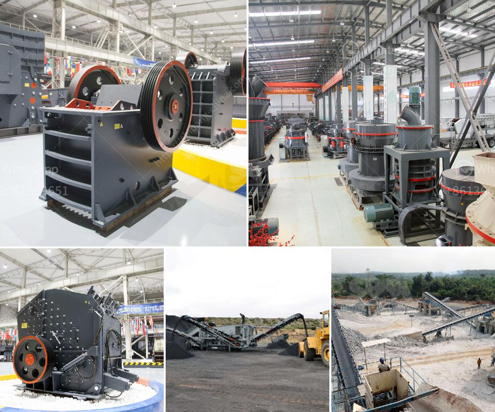

<h3>nigeria quartz plant in kenya</h3>
A groundbreaking project is set to revolutionize Kenya's construction industry, as Nigeria-based company, Quartz International, plans to establish a quartz plant in the country. This new venture is expected to not only create job opportunities but also enhance local infrastructure development.

Quartz, a mineral abundant in Nigeria, is known for its durability and aesthetic appeal. Its unique properties make it a popular choice for countertops, flooring, and other construction applications. However, the availability of quartz in Kenya has been limited, forcing the construction sector to rely heavily on imports. The establishment of a quartz plant within the country will not only reduce dependency on foreign sources but also boost the local economy.

One of the key advantages of this project is the creation of employment opportunities. The quartz plant is expected to employ a considerable number of Kenyans, particularly skilled workers who will be involved in the mining, processing, and manufacturing stages. This, in turn, will contribute to the reduction of unemployment rates and stimulate economic growth.

Moreover, having a local quartz plant will significantly enhance infrastructure development in Kenya. With easier access to quartz, construction companies will be able to source materials locally, cutting down on import costs and delays. This will speed up construction projects and allow for the timely completion of infrastructure, including residential buildings, office complexes, and public facilities.

Additionally, the established quartz plant will have a positive impact on the environment. Currently, importing quartz from Nigeria incurs high transportation costs and contributes to carbon emissions. By producing quartz locally, the carbon footprint associated with transportation will be reduced, making the construction sector more environmentally friendly.

In conclusion, the establishment of the Nigeria Quartz Plant in Kenya is a significant milestone for the construction industry. It will create job opportunities for Kenyans, reduce dependency on imports, enhance infrastructure development, and contribute to a greener environment. This project marks a bright future for Kenya's construction sector and sets an example for other countries in the region to follow.
<h3>Contact us</h3><ul><li><strong>Whatsapp:&nbsp;<a href="https://wa.me/8613661969651">+8613661969651</a></strong></li><li><a href="https://swt.shibang-china.com/?git&amp;zhl&amp;nigeria quartz plant in kenya"><strong>Online Service(chat now)</strong></a></li></ul><h3>Related</h3><ul><li><a href='portable crushing line.md'>portable crushing line</a></li><li><a href='dolomite crusher price.md'>dolomite crusher price</a></li><li><a href='how much does it cost to set up a mini cement plant.md'>how much does it cost to set up a mini cement plant</a></li><li><a href='list of stone crushers in odisha.md'>list of stone crushers in odisha</a></li><li><a href='small rotary burner for sale used in us.md'>small rotary burner for sale used in us</a></li></ul>