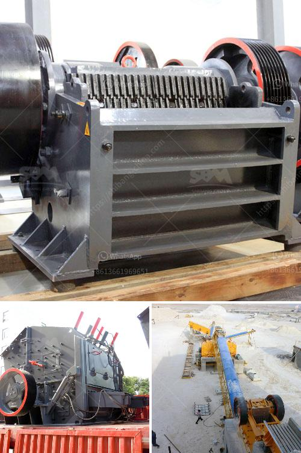

<h3>olx used crusher machines</h3>
In today's fast-paced world, where technology is constantly advancing, many people are looking to upgrade their machinery and equipment. Whether it's for personal use or a business venture, buying a brand new crusher machine can be a significant investment. That's why many individuals and companies are turning to platforms like OLX to find high-quality, reliable, and affordable used crusher machines.

OLX is a popular online marketplace that connects buyers and sellers from all over the world. With a wide range of categories, including machinery and equipment, it offers an extensive selection of used crusher machines at competitive prices. Here are some essential tips to help you find the perfect used crusher machine on OLX.

Do Your Research: Before starting your search, it's essential to understand your specific needs and requirements. Determine the type and size of crusher machine you need. Consider factors such as capacity, power consumption, and the materials you will be processing. This information will help you narrow down your search and find the most suitable options on OLX.

Browse the Listings: OLX provides an intuitive interface that allows you to browse through thousands of listings effortlessly. Begin by selecting the "Machinery" or "Equipment" category, then refine your search using filters such as price range, location, or brand. Take your time to go through the available listings, read the descriptions carefully, and look for detailed specifications and clear product images.

Communicate with Sellers: Once you've found a used crusher machine that matches your criteria, it's time to reach out to the seller. On OLX, you can do this by clicking on the "Chat" or "Call" feature offered in the listing. Communicating directly with the seller will enable you to gather more information about the machine's condition, usage history, and any specific maintenance or repairs it may require.

Inspect the Machine: Before making any final decisions, it is highly advisable to inspect the used crusher machine in person. This allows you to examine the machine's overall condition, check for any signs of wear and tear, and test its functionality. Arrange a meeting with the seller, request a demonstration, and ask questions about the machine's performance and maintenance. If you are unable to visit the seller in person, consider requesting additional photos or videos to get a better idea of the machine's current state.

Negotiate the Price: Once you are satisfied with the machine's condition, it's time to negotiate the price. Use your research on similar models and their market value to determine a fair price range. Engage in a constructive conversation with the seller, considering factors such as the machine's age, usage, and any additional accessories included. Remember that OLX is a platform where bargaining is often expected, so be prepared to negotiate.

Make the Purchase: After finalizing the price, it's time to make the purchase. On OLX, you have various payment options available, such as in-person cash transactions or online payment platforms. For larger transactions, it's a good idea to choose a payment method that offers buyer protection, such as an escrow service.

In conclusion, finding the perfect used crusher machine on OLX can be a rewarding experience if you approach it with the right mindset. Do thorough research, browse through listings, communicate with sellers, and inspect the machine in person to make an informed decision. Remember to negotiate the price, choose a secure payment method, and enjoy the benefits of acquiring a high-quality crusher machine at a fraction of the price. Happy shopping!
<h3>Contact us</h3><ul><li><strong>Whatsapp:&nbsp;<a href="https://wa.me/8613661969651">+8613661969651</a></strong></li><li><a href="https://swt.shibang-china.com/?git&amp;zhl&amp;olx used crusher machines"><strong>Online Service(chat now)</strong></a></li></ul><h3>Related</h3><ul><li><a href='limestone crusher manufacturers price.md'>limestone crusher manufacturers price</a></li><li><a href='coal grinding machinery manufacture in india.md'>coal grinding machinery manufacture in india</a></li><li><a href='how much cost to buildton cement plant.md'>how much cost to buildton cement plant</a></li><li><a href='ball mill machine in china.md'>ball mill machine in china</a></li><li><a href='marble crushing equipment.md'>marble crushing equipment</a></li></ul>