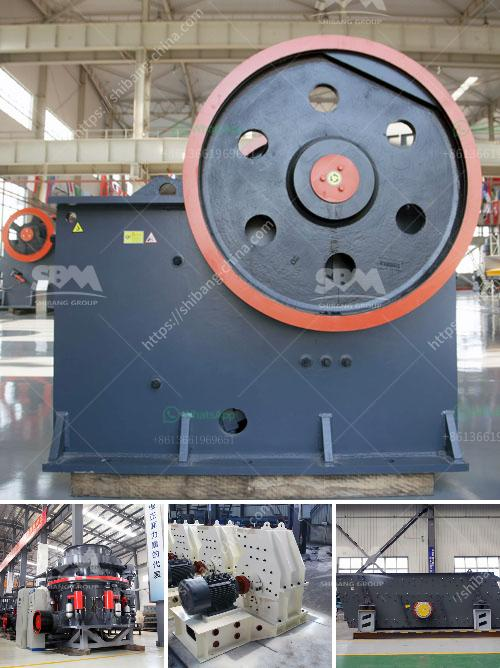

<h3>open cast mining china clay process</h3>
Open cast mining, also known as strip mining, is a process used in resource extraction where minerals are extracted from the earth by removing the surface layer. This method is typically used for near-surface, relatively flat deposits, such as china clay.

China clay, also known as kaolin, is a soft white mineral that is widely used in the production of ceramics, paper, paints, and many other products. Its properties, such as high plasticity, brightness, and whiteness, make it a valuable raw material.

The open cast mining process of china clay starts with the removal of overburden, which is the layer of earth above the mineral deposit. This is done using heavy excavation machinery and trucks. The overburden is usually composed of soil, rocks, and other unwanted materials that do not contain the desired mineral.

Once the overburden is removed, the next step is to extract the china clay. Excavators and dump trucks are used to dig out and transport the mineral to the processing plant. At the plant, the china clay is crushed, dried, and sorted into various particle sizes.

The processed china clay is then used in various industries. In ceramics, it is used as a binding agent and filler to improve the structural integrity and workability of clay-based materials. In the paper industry, it is used to enhance the surface finish and brightness of paper. It is also used in the production of paints, rubber, plastics, and even in the pharmaceutical industry.

China clay mining has been a significant industry in China, with vast deposits found in various regions of the country. However, it is essential to conduct open cast mining responsibly, ensuring minimal environmental impact. Companies engaged in this process are often required to restore the mining sites, re-vegetate the land, and mitigate any adverse effects on local ecosystems.

In conclusion, open cast mining is a vital process for extracting china clay from near-surface deposits. This versatile mineral plays a significant role in several industries, including ceramics, paper, and paints. However, it is crucial to approach mining operations responsibly, minimizing environmental impact and ensuring the long-term sustainability of the industry.
<h3>Contact us</h3><ul><li><strong>Whatsapp:&nbsp;<a href="https://wa.me/8613661969651">+8613661969651</a></strong></li><li><a href="https://swt.shibang-china.com/?git&amp;zhl&amp;open cast mining china clay process"><strong>Online Service(chat now)</strong></a></li></ul><h3>Related</h3><ul><li><a href='mining crusher costs.md'>mining crusher costs</a></li><li><a href='nigeria quartz plant in kenya.md'>nigeria quartz plant in kenya</a></li><li><a href='river pebble crusher supplier.md'>river pebble crusher supplier</a></li><li><a href='stone crusher machine assembling flow chart.md'>stone crusher machine assembling flow chart</a></li><li><a href='gypsum board making machine supplier.md'>gypsum board making machine supplier</a></li></ul>