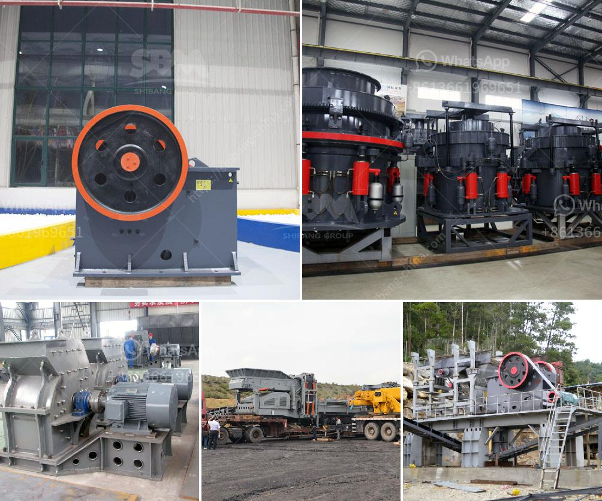

<h3>operating costs for a stone crusher plant</h3>
Operating costs for a stone crusher plant are higher than for a stationary crusher, but they also include labor, electricity, fuel, and maintenance costs. The type of crusher itself will also influence operating costs. For example, a stationary jaw crusher has lower operating costs compared to a mobile one.

The initial purchase cost of a stone crusher plant can vary widely depending on the size, type, and capacity of the plant. As per a manufacturer, the total cost of 50 tph stone crushing plant/line will be Rs. 75 to 80 lakhs. Machines 8 x4 feeder 3 lakh 30 x 15, dto (Double Toggles Oil) crusher, 10.50 lakh 36 x 06 two dto 1 8.60 lakh 16 x 05 vibrating screen, 6.15 lakh conveyors, motors cables. Feed size primary 40 cm, secondary feed size 7-10 cm, and output 20 to 40 mm.

The scope of these plants differs from a stone crusher to a whole rock crushing plant, including feeder, jaw crusher, impact crusher, vibrating screen, and belt conveyor applications. For more flexibility, the entire crushing plant needs to be portable and mobile. Types of stone crusher machines are cone crusher, jaw crusher, hammer crusher, and mobile crusher.

There are various types of stone crusher plants that are categorized as portable and mobile. The two main types are listed below:

1. Portable stone crusher plant: This type of plant is very flexible and easy to install. The configuration can be adjusted according to actual need and specifications, and can be easily integrated with other equipment to achieve a higher level of automation. It is suitable for various terrain conditions and can be widely used in urban construction waste treatment, road construction, and other fields.

2. Mobile stone crusher plant: This type of plant is very convenient to move from one site to another. It is especially suitable for narrow and complex areas. It saves time and effort in transporting materials and makes production more efficient. Moreover, it can be equipped with a generator set to ensure normal operation and provide power supply in case of emergency.

Apart from the initial purchase cost, operating a stone crusher plant also involves substantial operating costs. These include labor costs, electricity costs, fuel costs, and maintenance costs. Labor costs can make up a significant portion of the total operating cost. The number of workers required directly depends on the type and size of the plant. For example, a larger plant with more crushing units will require more workers.

Electricity costs are another important aspect to consider. The amount of electricity consumed by the plant will depend on the size of the plant, the type of crusher, and the particular application. A plant with high energy efficiency will help to reduce operating costs.

Fuel costs also need to be taken into account. The type of fuel used in the crusher plant will affect the overall operating costs. For example, diesel fuel is more expensive than electricity, so a plant that runs on diesel fuel may have higher operating costs compared to a plant that runs on electricity.

Maintenance costs are another key consideration. Regular maintenance is essential to keep the plant running smoothly and efficiently, and to prevent breakdowns and downtime. This includes regular inspection, lubrication, and replacement of worn-out parts. The cost of maintenance will depend on the type of plant and the particular maintenance requirements.

In conclusion, operating a stone crusher plant involves higher operating costs compared to a stationary crusher. These costs include labor, electricity, fuel, and maintenance costs. The type and size of the plant, as well as the type of crusher, will directly impact the operating costs. However, with proper planning and implementation, it is possible to reduce operating costs and increase profitability for a stone crusher plant.
<h3>Contact us</h3><ul><li><strong>Whatsapp:&nbsp;<a href="https://wa.me/8613661969651">+8613661969651</a></strong></li><li><a href="https://swt.shibang-china.com/?git&amp;zhl&amp;operating costs for a stone crusher plant"><strong>Online Service(chat now)</strong></a></li></ul><h3>Related</h3><ul><li><a href='limestone mobile crusher supplier in malaysia.md'>limestone mobile crusher supplier in malaysia</a></li><li><a href='coal dry processing plant.md'>coal dry processing plant</a></li><li><a href='controlling parameter of impact crusher.md'>controlling parameter of impact crusher</a></li><li><a href='roller mill suppliers in mexico.md'>roller mill suppliers in mexico</a></li><li><a href='granite rock breaking machine manufacturer in mlaysia.md'>granite rock breaking machine manufacturer in mlaysia</a></li></ul>