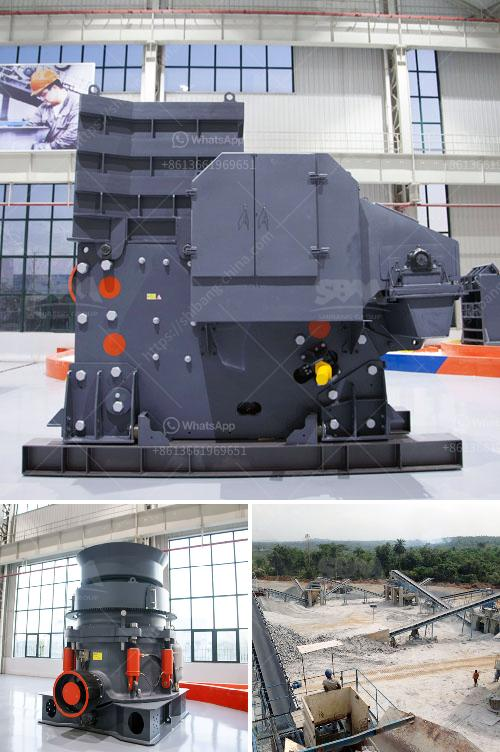

<h3>ore crushing machine</h3>
The mining industry is at the core of global economic growth, providing essential materials for various sectors, including construction, manufacturing, and energy production. Within this expansive industry, ore crushing machines play a crucial role in breaking down raw materials into smaller, manageable pieces that can be processed further. This article explores the significance and advancements in ore crushing machines, highlighting their ability to improve efficiency, productivity, and safety in mining operations.

Ore crushing machines, also known as rock crushers, are utilized to break down large stones and minerals extracted from the Earth's crust into smaller fragments. These machines possess immense strength and durability to withstand the significant forces required to reduce solid materials to manageable sizes, ready for further refinement. By efficiently transforming raw materials into more manageable forms, crushing machines enable mining companies to extract maximum value from the resources they acquire.

Over the years, advancements in engineering and technology have driven innovation in ore crushing machines, making them more efficient and versatile. High-pressure grinding rolls (HPGR), for instance, have revolutionized the mining industry by offering significant advantages over more traditional crushing methods. HPGR can process large quantities of ore while reducing energy consumption and minimizing the use of water, contributing to a more sustainable and eco-friendly mining process.

These machines are also equipped with automation systems that enhance productivity and operational safety. These automated systems enable ore crushing machines to self-adjust and optimize parameters, such as speed and pressure, based on real-time data. Sensors and monitoring devices provide operators with vital information about machine performance, allowing for quick adjustments to enhance efficiency and prevent costly breakdowns or accidents.

The implementation of advanced ore crushing machines has brought several benefits to the mining industry. Firstly, these machines increase productivity by ensuring a continuous and efficient material processing flow. This reduces downtime, maximizing the utilization of available resources and boosting overall operational output.

Secondly, ore crushing machines help mining companies reduce costs associated with transportation and extraction processes. By breaking down raw materials on-site, both the quantity and weight of materials requiring transportation can be significantly reduced, resulting in substantial savings on logistics.

Furthermore, ore crushing machines contribute to operational safety. With the introduction of automated systems, human error is minimized, reducing the likelihood of accidents. Real-time monitoring also allows operators to identify potential issues before they escalate, preventing harm to workers and expensive unplanned shutdowns.

Ore crushing machines are vital components of the mining industry, enabling the extraction of valuable materials from the Earth's crust. The continuous development of these machines, thanks to technological advancements, has brought about significant improvements in efficiency, productivity, and safety. By harnessing the power of ore crushing machines, mining companies can optimize their operations, minimize environmental impact, and enhance profitability, ultimately fueling the growth of economies worldwide.
<h3>Contact us</h3><ul><li><strong>Whatsapp:&nbsp;<a href="https://wa.me/8613661969651">+8613661969651</a></strong></li><li><a href="https://swt.shibang-china.com/?git&amp;zhl&amp;ore crushing machine"><strong>Online Service(chat now)</strong></a></li></ul><h3>Related</h3><ul><li><a href='how to start a stone quarry business.md'>how to start a stone quarry business</a></li><li><a href='jaw crushers for sale in uganda.md'>jaw crushers for sale in uganda</a></li><li><a href='price of stone crusher plant.md'>price of stone crusher plant</a></li><li><a href='quartz grinding machine.md'>quartz grinding machine</a></li><li><a href='flow diagram for limestone process.md'>flow diagram for limestone process</a></li></ul>