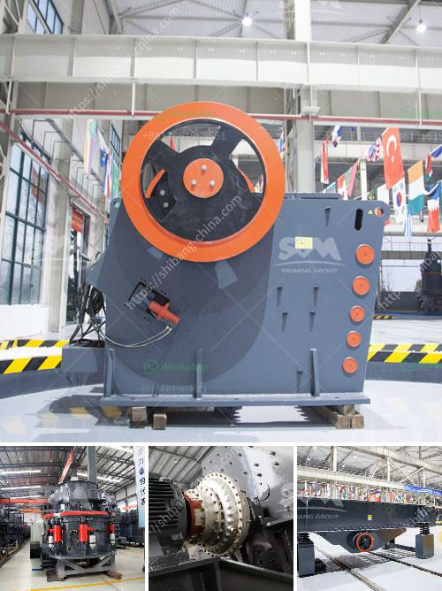

<h3>output size for a jaw crusher</h3>
A jaw crusher is a primary crushing machine in which large stones are passed through a vibrating screen to be broken down into smaller sizes. These smaller sizes are then further processed through the use of impact crushers, cone crushers, and other similar machines. The output size of a jaw crusher greatly influences the overall efficiency and performance of the crushing process. Therefore, understanding the importance of output size and how to achieve the desired size becomes crucial.

The output size of a jaw crusher refers to the size of the materials after being crushed by the jaw crusher. It is one of the critical factors that determines the efficiency of the crushing process and the quality of the final product. The output size can range from several millimeters to several centimeters, depending on the specific requirements of the application.

Achieving the desired output size requires careful consideration of various factors such as the type and hardness of the material being crushed, the gap setting of the jaw crusher, and the speed of the machine. Additionally, the size and shape of the jaw crusher's crushing chamber also play a significant role in determining the output size. A narrower crushing chamber tends to produce finer output, while a wider chamber results in coarser output.

To achieve the desired output size with a jaw crusher, it is essential to ensure that the machine is set up correctly. This includes adjusting the gap setting of the jaw crusher to control the size of the output material. Regular maintenance and monitoring of the machine are also necessary to ensure smooth and efficient operation.

In conclusion, the output size for a jaw crusher is a critical factor in determining the overall efficiency and quality of the crushing process. Proper adjustment of the machine, including the gap setting and maintenance, is essential to achieve the desired output size. By carefully considering these factors, operators can optimize the output size, resulting in improved productivity and higher quality final products.
<h3>Contact us</h3><ul><li><strong>Whatsapp:&nbsp;<a href="https://wa.me/8613661969651">+8613661969651</a></strong></li><li><a href="https://swt.shibang-china.com/?git&amp;zhl&amp;output size for a jaw crusher"><strong>Online Service(chat now)</strong></a></li></ul><h3>Related</h3><ul><li><a href='limestone crusher screening types plant.md'>limestone crusher screening types plant</a></li><li><a href='flow diagram for limestone process.md'>flow diagram for limestone process</a></li><li><a href='cement clinker powder line.md'>cement clinker powder line</a></li><li><a href='how to start a coal mine.md'>how to start a coal mine</a></li><li><a href='rock crushers manufacturers.md'>rock crushers manufacturers</a></li></ul>