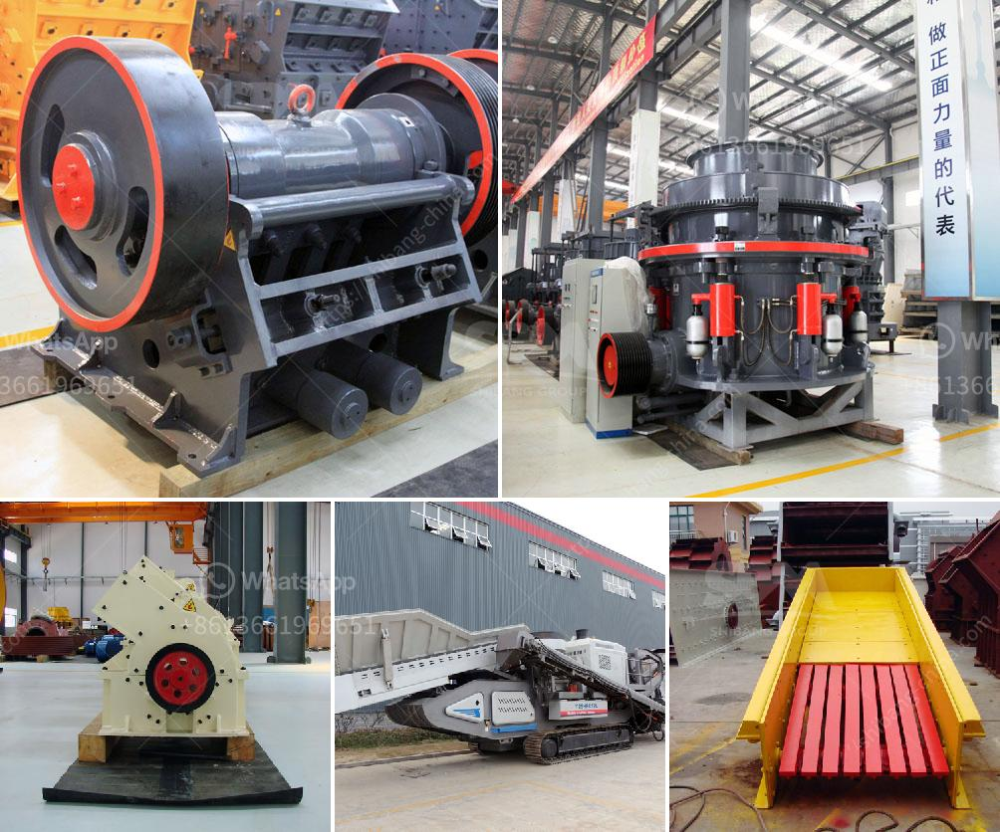

<h3>pakistan silica sand washing plant</h3>
Sand is the primary ingredient in concrete and is considered one of the world's most abundant natural resources. Silica sand mining and washing have been practiced in Pakistan for millennia; however, the recent surge in demand for high-quality, clean silica sand has led to a sudden increase in mining and washing facilities throughout the country.

One such facility is the Pakistan Silica Sand Washing Plant, which is designed to extract high-quality, fine-grained silica sand utilizing state-of-the-art washing technology. The plant operates on the principle of gravity concentration and is capable of washing, grading, and dewatering sand particles to produce a clean and saleable product.

The washing process at the Pakistan Silica Sand Washing Plant involves three crucial steps. First, the sand is fed into the intake pit through a conveyor belt, where it is mixed with water to create a slurry. Then, the slurry is fed into a system of hydro-cyclones, which separates the sand particles based on their size and density. Finally, the washed sand is collected from the hydro-cyclones and dewatered using a vibrating screen, ensuring a moisture content of less than 12%.

The demand for silica sand in various industries, such as glass manufacturing, construction, and foundries, has increased rapidly in Pakistan and other parts of the world. Hence, the establishment of the Pakistan Silica Sand Washing Plant is a step taken towards fulfilling this growing demand. By ensuring the production of high-quality, clean sand, this facility aids in maintaining the quality standards required by these industries.

Furthermore, the usage of advanced washing technology in the Pakistan Silica Sand Washing Plant ensures environmental sustainability. By properly managing water usage and removing fine silt and impurities from the sand, the plant minimizes the environmental impact associated with silica sand mining and washing.

In conclusion, the Pakistan Silica Sand Washing Plant plays a crucial role in promoting the country's development by catering to the growing demand for clean silica sand. By employing advanced washing technology and adhering to environmental standards, the plant helps meet quality requirements while ensuring sustainability in the process. With the continuous efforts of facilities like this, Pakistan can become a significant player in the global silica sand market and contribute to its economic growth.
<h3>Contact us</h3><ul><li><strong>Whatsapp:&nbsp;<a href="https://wa.me/8613661969651">+8613661969651</a></strong></li><li><a href="https://swt.shibang-china.com/?git&amp;zhl&amp;pakistan silica sand washing plant"><strong>Online Service(chat now)</strong></a></li></ul><h3>Related</h3><ul><li><a href='vibrating screens manufacturers in south africa.md'>vibrating screens manufacturers in south africa</a></li><li><a href='hammer mills in south africa.md'>hammer mills in south africa</a></li><li><a href='concrete stone crusher south africa.md'>concrete stone crusher south africa</a></li><li><a href='types of stone crusher machine list.md'>types of stone crusher machine list</a></li><li><a href='combined gold and diamond wash plants.md'>combined gold and diamond wash plants</a></li></ul>