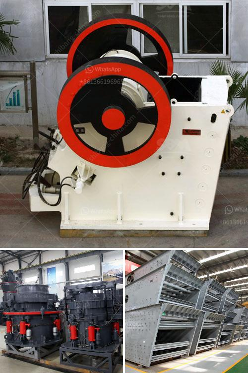

<h3>pe 100 jaw crusher</h3>
The jaw crusher, also known as the PE series jaw crusher, is a highly efficient and energy-saving crushing equipment for mining and mineral processing industries. It combines the advanced technology of the modern crushing industry and adopts the technological innovation of the European version, making it a perfect choice for crushing hard and abrasive materials.

With a jaw crusher, materials are compressed between a moving and a static plate, reducing the size of rocks and other materials. The PE 100 jaw crusher is a high-power machine designed for large-scale stone crushing projects. The crushing chamber is deep and wide, ensuring an excellent performance even in demanding conditions.

One of the most significant benefits of the PE 100 jaw crusher is its robust construction. Made of high-quality cast steel, the crusher frame is exceptionally strong and durable. This ensures that the crusher can withstand the heaviest of loads, making it ideal for demanding applications. Furthermore, the heavy-duty eccentric shaft is forged from special alloy steel, guaranteeing its resistance to wear and tear.

The PE 100 jaw crusher is also equipped with excellent safety features. Its safety guard protects the operator from any potential danger during the crushing process. Moreover, the flywheel cover ensures that no materials or debris enter the flywheel and affect the normal operation of the crusher. This enhances the safety and reliability of the machine, giving operators peace of mind.

In terms of performance, the PE 100 jaw crusher stands out as a high-power machine. Its advanced hydraulic system adjusts the discharge port, ensuring accurate and efficient control of the size of the final product. Equipped with a large and efficient crushing chamber, the crusher provides high production capacities and excellent crushing ratios. This means that the machine can handle large volumes of materials, increasing productivity and reducing operating costs.

The PE 100 jaw crusher is also designed for easy maintenance. The removable crushing plate allows for quick and easy replacement, reducing downtime and increasing operational efficiency. Additionally, the centralized lubrication system ensures that the machine is properly lubricated at all times. This prolongs the service life of the machine and reduces the frequency of maintenance tasks.

With its outstanding performance, robust construction, and excellent safety features, the PE 100 jaw crusher is an excellent choice for large-scale stone crushing projects. It offers high crushing capacities, reliable operation, and low maintenance requirements, making it a cost-efficient and reliable solution that meets the needs of the modern mining and mineral processing industries.

In conclusion, the PE 100 jaw crusher is a high-power machine designed for large-scale stone crushing. Its robust construction, excellent safety features, and efficient performance make it a top choice for demanding applications. With its ability to handle large volumes of materials, the PE 100 jaw crusher offers high productivity and reduced operating costs, ensuring a cost-efficient and reliable crushing solution for mining and mineral processing industries.
<h3>Contact us</h3><ul><li><strong>Whatsapp:&nbsp;<a href="https://wa.me/8613661969651">+8613661969651</a></strong></li><li><a href="https://swt.shibang-china.com/?git&amp;zhl&amp;pe 100 jaw crusher"><strong>Online Service(chat now)</strong></a></li></ul><h3>Related</h3><ul><li><a href='project cost of stone crusher of 100 tph.md'>project cost of stone crusher of 100 tph</a></li><li><a href='pulveriser machine new technolgy.md'>pulveriser machine new technolgy</a></li><li><a href='puzzolana tph cone crusher plant prices.md'>puzzolana tph cone crusher plant prices</a></li><li><a href='vertical mill of a cement company.md'>vertical mill of a cement company</a></li><li><a href='pe 100 jaw crusher.md'>pe 100 jaw crusher</a></li></ul>