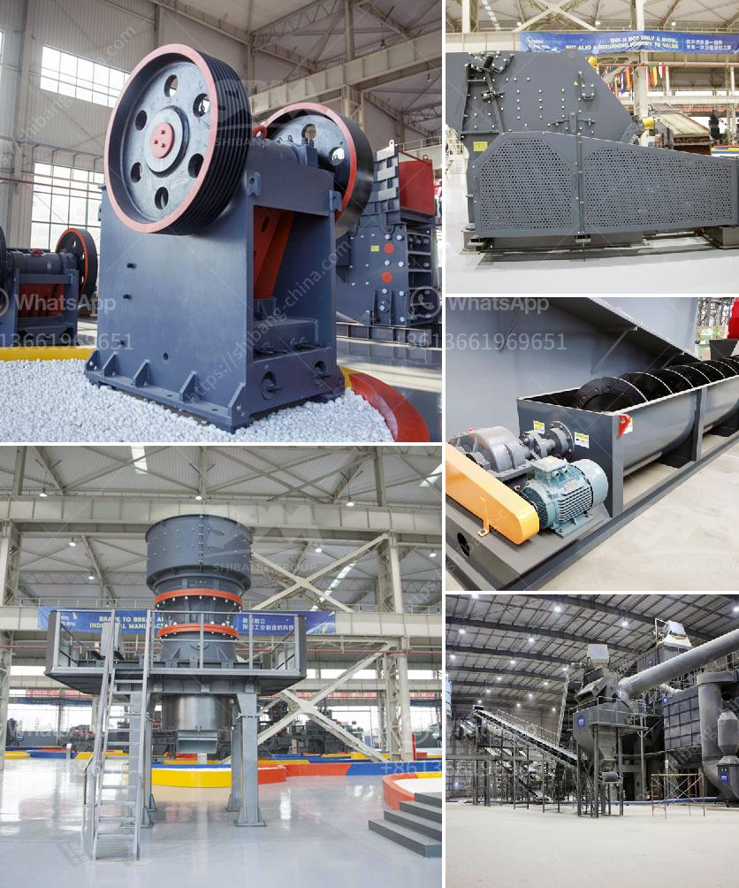

<h3>pf impact crusher</h3>
The PF impact crusher is a high-efficiency and energy-saving crushing equipment that can handle various coarse, medium, and fine materials with a side length of 100-600 mm or less and a compressive strength of not more than 350 MPa. 

Mainly used in metallurgy, chemical industry, hydropower engineering, and other industries, it has the advantages of large crushing ratio, simple structure, convenient maintenance, and low operation cost. The finished product is cubic, with good grain shape and high quality.

The unique design of the rotor structure of the PF impact crusher increases the crushing space and the material can be fully crushed, which greatly improves the crushing efficiency. The impact plate is made of high chromium material, which is highly resistant to impact, abrasion, and corrosion, ensuring the stability and durability of the equipment.

The advanced hydraulic system makes it easy to adjust the discharge port and maintain a constant discharge opening, which greatly improves the flexibility and reliability of the equipment. In addition, the mechanical adjustment device can quickly adjust the clearance between the impact plate and the hammer, effectively controlling the particle size of the finished product.

The PF impact crusher is equipped with a heavy-duty rotor, wear-resistant materials, and an optimal crushing chamber design. This combination has proven to provide increased production capacity, improved product quality, and reduced operating and wear costs.

Whether used in quarrying, mining, construction, or recycling, the PF impact crusher is an ideal choice for crushing and screening. Its robust and versatile design ensures optimal performance and reliability, making it suitable for a wide range of applications.
<h3>Contact us</h3><ul><li><strong>Whatsapp:&nbsp;<a href="https://wa.me/8613661969651">+8613661969651</a></strong></li><li><a href="https://swt.shibang-china.com/?git&amp;zhl&amp;pf impact crusher"><strong>Online Service(chat now)</strong></a></li></ul><h3>Related</h3><ul><li><a href='quarry business plan.md'>quarry business plan</a></li><li><a href='stone quarry machine manufacturers.md'>stone quarry machine manufacturers</a></li><li><a href='linear vibrating screener nigeria.md'>linear vibrating screener nigeria</a></li><li><a href='used ultra fine wet grinding mill gold ore.md'>used ultra fine wet grinding mill gold ore</a></li><li><a href='flow chart for gold extraction from ores.md'>flow chart for gold extraction from ores</a></li></ul>