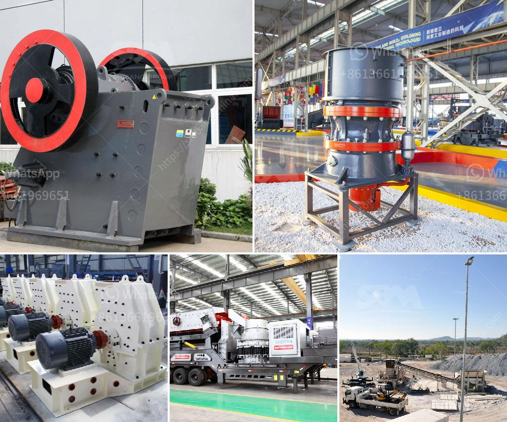

<h3>picture of silica sand process plant</h3>
Silica sand, also known as industrial sand, is one of the most abundant minerals on Earth. It is characterized by its high silicon dioxide (SiO2) content and is primarily used in the production of glass, ceramics, foundry molds, fracking sands, and various industrial applications. The process plant for producing silica sand typically consists of equipment such as crushers, screening machines, dryers, classifiers, and storage facilities. In this article, we will explore the various stages of the silica sand processing plant and how it transforms raw material into a valuable industrial resource.

The first stage of the process plant involves the extraction of raw silica sand from quarries or mines. These sources can vary in terms of quality, purity, and size distribution. The raw material is then transported to the processing plant, where it undergoes several stages of mechanical and chemical processing to meet industry specifications.

The second stage of the process is the initial crushing of the raw silica sand using crushers. These machines reduce the size of the material into smaller particles, ensuring optimal efficiency in downstream processes. The crushed sand is then sent to a screening machine, where it is sorted into different grades, depending on the required particle size distribution.

Once the silica sand has been sized and graded, it is sent to a dryer for moisture removal. The drying process is crucial as it eliminates any excess moisture that could impact the quality of the final product. Drying also ensures that silica sand can be stored and transported without degradation.

After drying, the processed silica sand undergoes further classification and purification processes. Classifiers are used to separate the sand into different grades based on particle size. This stage ensures that the silica sand meets industry specifications and is suitable for various applications.

Purification processes, such as attrition scrubbing and flotation, may also be employed to remove impurities from the silica sand. These impurities can include clay, iron oxides, and organic matter, which need to be eliminated to enhance the quality and purity of the final product.

Once the silica sand has been processed, it is stored in large silos or storage facilities. These storage units are designed to protect the sand from contamination and facilitate easy loading and transportation. The silica sand can then be shipped to customers or further processed for specific applications.

The picture of a silica sand processing plant captures the complex and intricate nature of the process. It showcases the different stages and equipment involved in transforming raw silica sand into a valuable industrial resource. From crushing and screening to drying, classification, and purification, each step is carefully executed to ensure the production of high-quality silica sand.

In conclusion, the process plant for producing silica sand plays a vital role in transforming raw material into a valuable industrial resource. The various stages and equipment involved in the process are crucial in producing silica sand that meets the diverse requirements of different industries. With the demand for silica sand expected to rise in the coming years, the importance of efficient and sustainable processing plants cannot be overstated.
<h3>Contact us</h3><ul><li><strong>Whatsapp:&nbsp;<a href="https://wa.me/8613661969651">+8613661969651</a></strong></li><li><a href="https://swt.shibang-china.com/?git&amp;zhl&amp;picture of silica sand process plant"><strong>Online Service(chat now)</strong></a></li></ul><h3>Related</h3><ul><li><a href='grinding machine philippines.md'>grinding machine philippines</a></li><li><a href='between cone and horizontal impact crusher.md'>between cone and horizontal impact crusher</a></li><li><a href='used in vibrating screens.md'>used in vibrating screens</a></li><li><a href='screening and wash plant manufacturers in south africa.md'>screening and wash plant manufacturers in south africa</a></li><li><a href='difference between pebble and stone.md'>difference between pebble and stone</a></li></ul>