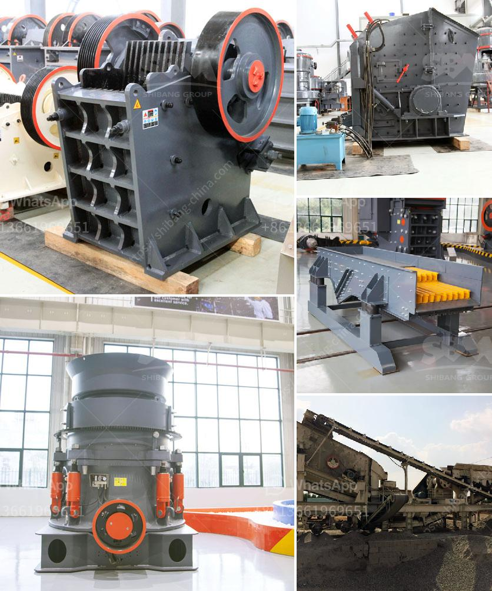

<h3>portable ballast crusher for sale</h3>
Portable ballast crusher, also called mobile crusher, is suitable for various types of crushing, as well as screening operations. It is designed to crush hard materials such as limestone, granite, basalt, andesite, river pebble, iron ore, etc. with a maximum feed size of up to 450mm.

Portable ballast crusher for sale can be divided into two different types according to the driving mode: crawler-type mobile crusher and tire-type mobile crusher. Crawler-type mobile crushing plant is equipped with a high-performance jaw crusher, impact crusher or cone crusher, while tire-type mobile crushing plant is equipped with a high-performance mobile crusher.

Portable ballast crusher for sale adopts electric motor as the power, and the eccentric shaft is revolved by an electric motor through v-belts. It causes the swing jaw to follow the preconcerted path and crush the in-fed materials, and then crush them again in the swing jaw.

Portable ballast crusher for sale also crushes ore, granite, etc. It is widely used in mining, metallurgy, building materials, highway, railway, water conservancy, chemical industry, and other industries.

Portable ballast crusher for sale can crush a variety of hard rocks, such as basalt, diabase, granite, limestone, etc. Usually, it will use cone crusher as the primary crushing machine. Ballast crushing equipment can process large stones into smaller pieces, suitable for secondary or tertiary crushing operation.

Portable ballast crusher for sale can crush 250 300 tons per hour and can crush 6 8 inches diameter boulder capacity etc. Jaw crusher PE1200×1500 for primary crushing, impact crusher PF1315 for secondary crushing, screen is to separate the different sizes of materials.

Belt conveyor is a necessary equipment for the complete portable crushing plant. You need to install the belt conveyor with an adjustable inclination angle.

The portable ballast crusher for sale is easy to install and operate, and is the best choice for home projects. It can crush a large amount of ore stone to a medium-sized particle size at one time, not only simplifying the secondary crushing process, but also greatly improving the processing capacity of the entire production line.

Portable ballast crusher for sale is suitable for primary crushing of many materials with compressive strength under 350MPa. It has a large crushing ratio, high efficiency, low energy consumption, and uniform product size. In the selection of the type of crusher, the motor power and the corresponding productivity should be taken into account to ensure the quality of the final product.

In conclusion, portable ballast crusher for sale is suitable for various types of crushing requirements, and provides customers with high-efficiency and low-cost crushing equipment. It has strong mobility and can directly enter the crushing site for on-site crushing, eliminating the need to transport materials. With the continuous advancement of technology, portable ballast crusher for sale will continue to develop and innovate, providing customers with more efficient and environmentally friendly crushing equipment.
<h3>Contact us</h3><ul><li><strong>Whatsapp:&nbsp;<a href="https://wa.me/8613661969651">+8613661969651</a></strong></li><li><a href="https://swt.shibang-china.com/?git&amp;zhl&amp;portable ballast crusher for sale"><strong>Online Service(chat now)</strong></a></li></ul><h3>Related</h3><ul><li><a href='belt conveyors used in crushing plant.md'>belt conveyors used in crushing plant</a></li><li><a href='industrial hammer mill.md'>industrial hammer mill</a></li><li><a href='grinder mill powder singapore.md'>grinder mill powder singapore</a></li><li><a href='conveyor belt distributor in nigeria.md'>conveyor belt distributor in nigeria</a></li><li><a href='costs of a grinding mill.md'>costs of a grinding mill</a></li></ul>