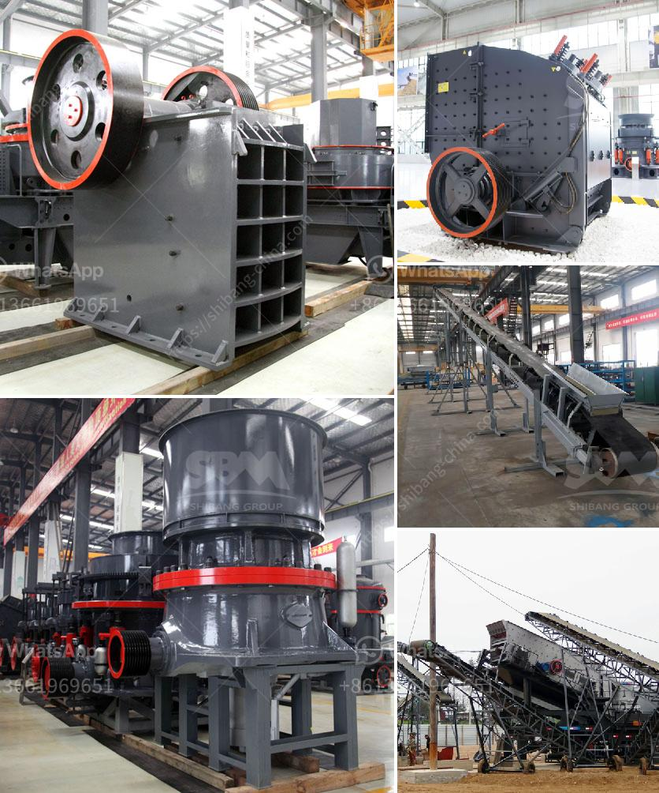

<h3>portable crusher machine</h3>
In today's modern world, technology is advancing at an unprecedented rate. This is particularly evident in the construction industry, where new tools and equipment are constantly being developed to make construction projects more efficient and cost-effective. One such innovation is the portable crusher machine.

A portable crusher machine is a machine that breaks down large rocks into smaller pieces. The size of the pieces can range from coarse to medium-fine, depending on the machine and its settings. Portable crusher machines are used on construction sites to reduce waste and make hauling and disposal of the debris more convenient.

One of the main benefits of using a portable crusher machine is its flexibility. Unlike traditional crushers, which are fixed in one location, these machines are designed to be easily moved from one site to another. This allows construction companies to use the machine on multiple projects, reducing costs and increasing productivity.

The portability of these machines also makes them ideal for remote or hard-to-reach locations. Traditional crushers require a lot of groundwork to set up, but portable crusher machines can be transported easily and set up within a short period of time. This makes them perfect for construction sites in rural areas or on uneven terrains where access may be limited.

Another advantage of using a portable crusher machine is its cost-effectiveness. Construction companies can save a significant amount of money by using these machines. Instead of relying on expensive trucking services to transport the debris to a disposal site, the machine can be used on site to crush the material and create reusable aggregates. This not only saves money on transportation costs but also eliminates the need for additional equipment to process the debris.

Moreover, portable crusher machines are designed to be energy-efficient. Many models are equipped with advanced features that allow them to consume less power while still delivering high performance. This reduces the carbon footprint of construction projects and contributes to a more sustainable construction industry.

One of the key aspects of a portable crusher machine is its versatility. These machines can be used to process a wide range of materials, from rock and concrete to asphalt and construction waste. They can produce various sizes of aggregates based on the requirements of the project. This makes them an invaluable tool for construction companies as they can easily adapt to different site conditions and project specifications.

In conclusion, portable crusher machines have become an essential tool for construction sites. They offer flexibility, cost-effectiveness, and versatility, making them a convenient and efficient solution for crushing and recycling construction debris. As technology continues to advance, we can expect portable crusher machines to further improve, providing even greater benefits to the construction industry.
<h3>Contact us</h3><ul><li><strong>Whatsapp:&nbsp;<a href="https://wa.me/8613661969651">+8613661969651</a></strong></li><li><a href="https://swt.shibang-china.com/?git&amp;zhl&amp;portable crusher machine"><strong>Online Service(chat now)</strong></a></li></ul><h3>Related</h3><ul><li><a href='gravel production line.md'>gravel production line</a></li><li><a href='mobile jaw crusher tons per hour.md'>mobile jaw crusher tons per hour</a></li><li><a href='costs of a grinding mill.md'>costs of a grinding mill</a></li><li><a href='company that sells vibratory sieves in spain.md'>company that sells vibratory sieves in spain</a></li><li><a href='concrete crushing testing equipment.md'>concrete crushing testing equipment</a></li></ul>