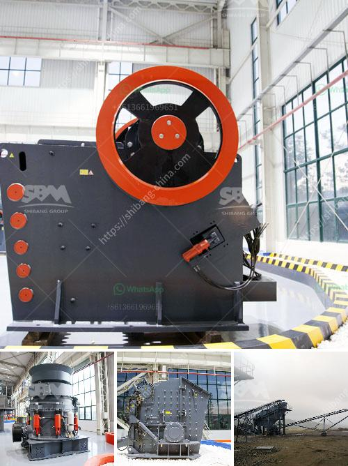

<h3>portable crushing line</h3>
In the world of construction, time is money. When it comes to completing projects on time and within budget, having the right equipment is crucial. This is particularly true when it comes to crushing and screening materials on-site. Thankfully, portable crushing lines have emerged as a game-changer in the industry, offering a cost-effective and efficient solution for construction sites.

A portable crushing line is a mobile production line that consists of a crusher, screening plant, and conveyors. These components are built on a sturdy and durable trailer, which allows for easy transportation between different construction sites. Whether it is grading rock, recycling asphalt and concrete, or crushing aggregates, a portable crushing line is designed to simplify the process and save valuable time.

One of the significant advantages of a portable crushing line is its versatility. It can handle various types of materials, including natural rock, concrete debris, and asphalt. This flexibility allows contractors to handle different projects without the need for multiple machines or additional equipment. Whether it is a small residential project or a large-scale commercial construction, a portable crushing line can adapt to the task at hand.

Another major benefit of portable crushing lines is their mobility. Traditional crushing equipment is fixed to a specific location, requiring materials to be transported to and from the site. This not only adds to logistical challenges but also increases costs associated with transportation. In contrast, a portable crushing line can be easily moved from site to site, reducing the need for material transportation and minimizing project costs.

The time saved with a portable crushing line is also significant. Traditional crushing processes often involve loading and unloading materials multiple times, which consumes valuable time and presents a higher risk of material loss. With a portable crushing line, materials can be processed directly on-site. From crushing to screening to loading, the entire process can be completed efficiently in one place, maximizing productivity and improving project timelines.

Additionally, portable crushing lines are environmentally friendly. By processing materials on-site, it reduces the need for excessive transportation, thus lowering carbon emissions associated with hauling materials to and from the site. Furthermore, portable crushing lines can play a vital role in recycling construction waste. Concrete debris and asphalt can be crushed and reused as aggregate for future construction projects, reducing the need for virgin materials and promoting sustainability.

In conclusion, portable crushing lines offer a range of advantages for construction sites. Their flexibility, mobility, and efficiency make them the ultimate solution for crushing and screening materials on-site. With reduced transportation costs, improved project timelines, and environmental benefits, portable crushing lines have become an essential tool in the construction industry. Contractors who invest in this technology will undoubtedly experience improved productivity, reduced costs, and greater customer satisfaction.
<h3>Contact us</h3><ul><li><strong>Whatsapp:&nbsp;<a href="https://wa.me/8613661969651">+8613661969651</a></strong></li><li><a href="https://swt.shibang-china.com/?git&amp;zhl&amp;portable crushing line"><strong>Online Service(chat now)</strong></a></li></ul><h3>Related</h3><ul><li><a href='price ball mill 40tph.md'>price ball mill 40tph</a></li><li><a href='small rotary burner for sale used in us.md'>small rotary burner for sale used in us</a></li><li><a href='semi mobile crusher plant.md'>semi mobile crusher plant</a></li><li><a href='grinding machine for white clay in india.md'>grinding machine for white clay in india</a></li><li><a href='mica mill roller mill.md'>mica mill roller mill</a></li></ul>