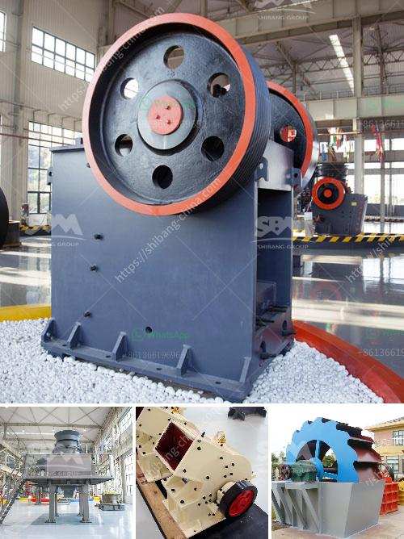

<h3>portable hydraulic rock crusher</h3>
When it comes to crushing rocks, there are three key options available to you: the traditional jaw crusher, the gyratory crusher, and the portable hydraulic rock crusher. Each of these rock-crushing machines offers a unique method of breaking down rocks, but all reach the same ultimate goal: reducing large rocks to smaller, more manageable particles. In this article, we will focus on the portable hydraulic rock crusher and its many advantages.

A portable hydraulic rock crusher is a versatile and powerful tool that requires less effort from the operator. Compared to other methods such as breaking rocks manually or using explosives, a portable hydraulic rock crusher is more efficient and less labor-intensive. It also allows for greater mobility, as it can be easily transported to different worksites.

One of the main advantages of a portable hydraulic rock crusher is its ease of use. This machine requires minimal training and can be operated by almost anyone with basic knowledge of rock crushing. The operator simply needs to feed rocks into the hopper, adjust the settings, and let the machine do the rest. The hydraulic system within the crusher applies pressure to the rocks, breaking them down into smaller pieces. This makes it a straightforward and hassle-free process for the operator.

Another advantage of a portable hydraulic rock crusher is its ability to handle a wide range of rock types and sizes. Whether you are working with limestone, granite, or any other material, the crusher can handle it with ease. The adjustable settings allow you to produce various sizes of crushed rock, making it suitable for different applications.

Mobility is a significant advantage of a portable hydraulic rock crusher. Traditional crushers are fixed in one location, making it difficult to transport them to different worksites. However, a portable hydraulic rock crusher can be easily transported on a trailer or truck and taken to any location you desire. This feature is particularly useful for construction projects, where rocks need to be crushed on-site. It eliminates the need to transport rocks back and forth, saving time and money.

In addition to portability, a portable hydraulic rock crusher is also more environmentally friendly compared to traditional methods. Using explosives or manually breaking rocks can release harmful dust, smoke, and fumes into the air. The portable hydraulic rock crusher, on the other hand, operates quietly and efficiently, resulting in minimal air pollution. This makes it a safer and more sustainable option for both the operator and the environment.

In conclusion, a portable hydraulic rock crusher is a powerful and efficient tool for breaking down rocks of various types and sizes. Its ease of use, versatility, and mobility make it an excellent choice for construction projects and other applications. With its minimal environmental impact, this machine is not only a practical solution but also a responsible one. So, if you are looking to crush rocks on the go, consider investing in a portable hydraulic rock crusher.
<h3>Contact us</h3><ul><li><strong>Whatsapp:&nbsp;<a href="https://wa.me/8613661969651">+8613661969651</a></strong></li><li><a href="https://swt.shibang-china.com/?git&amp;zhl&amp;portable hydraulic rock crusher"><strong>Online Service(chat now)</strong></a></li></ul><h3>Related</h3><ul><li><a href='capital cost gold processing plant.md'>capital cost gold processing plant</a></li><li><a href='mobile coal jaw crusher for hire.md'>mobile coal jaw crusher for hire</a></li><li><a href='crusher mandrel crusher price.md'>crusher mandrel crusher price</a></li><li><a href='used stone crusher in europe for sale.md'>used stone crusher in europe for sale</a></li><li><a href='used machine hammer mill.md'>used machine hammer mill</a></li></ul>