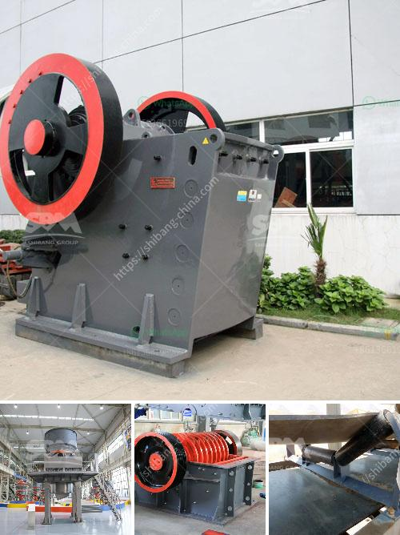

<h3>portable rock crusher rental</h3>
Portable rock crusher rental is a relatively new concept in the construction industry. For years, large pieces of equipment have been used to crush oversized rocks into smaller pieces suitable for use as fill or base materials. Remediation of sites with large quantities of rocks present a logistical challenge for construction workers as they must constantly move large, heavy equipment to different areas of the site.

However, with the advent of portable rock crushers, this job has become much easier. Instead of hauling oversized rocks to the crushing site, mobile crushers allow the rock to be crushed right at the construction site. With a variety of sizes and models available, these crushers are suitable for any project, big or small.

One of the key advantages of a portable rock crusher is its flexibility. When compared to conventional crushers, portable crushers have a compact design that enables them to be easily transported from one location to another. This makes it possible to transport the equipment to different areas of the site, reducing the need for excessive transportation.

Another advantage of portable rock crusher rental is the ability to move the machine around the job site easily. This flexibility allows contractors to use the machine for various projects in different locations. Since the equipment can be transported and set up in a matter of hours, it can be quickly put to work to generate revenue for the contractor.

Portable rock crusher rental also allows for flexibility in terms of location. Many of the crushing jobs we’ve undertaken in recent years have been in urban environments where space is limited. By utilizing portable rock crusher rental, contractors can reduce transportation costs and minimize the environmental impact on the surrounding area.

In addition to the convenience of mobility, portable rock crushers have a wide range of applications. Depending on the model, portable crushers can be used for crushing limestone, granite, or concrete to meet specific needs. With a variety of options available, such as hydraulic and diesel power, portable rock crushers ensure optimum productivity and efficiency for every project.

When considering portable rock crusher rental, there are a few things to keep in mind. First, assess the needs of your project. For example, if you are crushing concrete, you may need a machine that can handle higher production rates. On the other hand, if you are crushing limestone, a smaller portable crusher may be a better fit.

Second, consider the size and weight of the equipment. Make sure you have the necessary resources to transport and set up the machine on your job site. If space is a concern, compact models may be a better option.

Lastly, ensure that the rental company provides proper training and support for using the portable rock crusher. Safety should always be a top priority, so understanding how to operate the machine and follow safety guidelines is crucial.

In conclusion, portable rock crusher rental offers a wide range of benefits for construction and demolition companies. From reducing transportation costs to increasing flexibility and efficiency, portable crushers are an invaluable asset for any project. When considering rental options, be sure to assess your project needs and choose the right equipment for the job. With the help of a reputable rental company, you can easily crush rocks on-site and complete your projects with ease.
<h3>Contact us</h3><ul><li><strong>Whatsapp:&nbsp;<a href="https://wa.me/8613661969651">+8613661969651</a></strong></li><li><a href="https://swt.shibang-china.com/?git&amp;zhl&amp;portable rock crusher rental"><strong>Online Service(chat now)</strong></a></li></ul><h3>Related</h3><ul><li><a href='estimated budget for a conveyor belt.md'>estimated budget for a conveyor belt</a></li><li><a href='gold mining equipment for sale in singapore.md'>gold mining equipment for sale in singapore</a></li><li><a href='how profitable is tipping truck business in nigeria.md'>how profitable is tipping truck business in nigeria</a></li><li><a href='three roll mills supplier.md'>three roll mills supplier</a></li><li><a href='processing plan for feldspar ore.md'>processing plan for feldspar ore</a></li></ul>