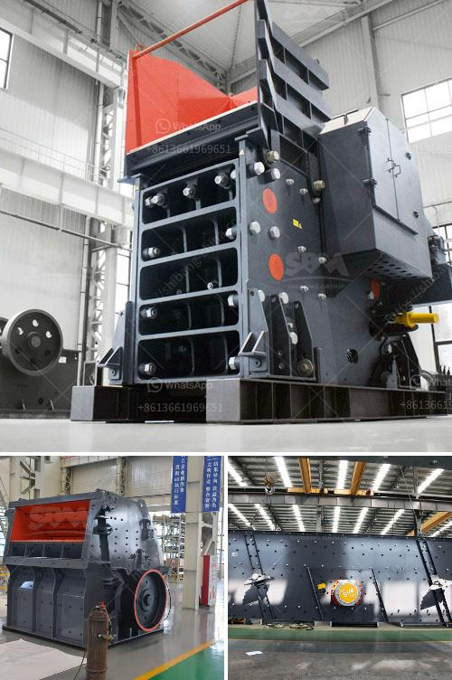

<h3>porur raymond grinding mill</h3>
Porur Raymond grinding mill is a versatile and dependable high-speed air-swept swing hammer impact mill designed for fine and medium grinding of soft non-metallic minerals, coals, various chemical compounds, food ingredients, and solid fuels.

Known for its reliable performance and robust construction, this grinding mill is widely used in chemical, mining, and metallurgical industries. It offers excellent particle size reduction capabilities and can grind a wide range of materials to a fine powder, ensuring a consistent and uniform product.

One of the key features of the Porur Raymond grinding mill is its effective air classifier. The mill uses air classification to separate the fine particles from the coarse ones, ensuring a high-quality final product. The classifier helps control the particle size distribution, ensuring that the desired particle size is achieved.

The grinding mill operates on the principle of impact grinding. It utilizes a series of rotating hammers to impact the material, causing it to break into small particles. The hammers are suspended on a rotor and revolve at high speed, generating a strong impact force. The material is fed into the grinding chamber and is continuously impacted by the hammers until it reaches the desired size.

The Porur Raymond grinding mill is designed for easy maintenance and servicing. It features a simple and robust design, allowing for quick and hassle-free access to all internal parts. This makes routine maintenance tasks, such as hammer replacement or screen changes, simple and efficient.

In addition to its grinding capabilities, the Porur Raymond grinding mill also offers excellent drying capabilities. The mill can be equipped with a hot air generator, which provides the necessary heat to dry the material before grinding. This feature makes the mill suitable for grinding materials with a high moisture content, further expanding its application range.

The Porur Raymond grinding mill is available in various sizes and configurations to meet the specific needs of different industries. It can be customized with different hammer configurations, screen sizes, and other optional features to achieve the desired grinding results.

In conclusion, the Porur Raymond grinding mill is a highly efficient and versatile grinding solution for various industries. Its reliable performance, excellent particle size reduction capabilities, and easy maintenance make it a preferred choice for grinding a wide range of materials. Whether it is coal, minerals, chemicals, or food ingredients, this grinding mill ensures a consistent and high-quality final product.
<h3>Contact us</h3><ul><li><strong>Whatsapp:&nbsp;<a href="https://wa.me/8613661969651">+8613661969651</a></strong></li><li><a href="https://swt.shibang-china.com/?git&amp;zhl&amp;porur raymond grinding mill"><strong>Online Service(chat now)</strong></a></li></ul><h3>Related</h3><ul><li><a href='hammer mill prices.md'>hammer mill prices</a></li><li><a href='price of portable stonecrusher.md'>price of portable stonecrusher</a></li><li><a href='silica sand screening plant.md'>silica sand screening plant</a></li><li><a href='gold mining equipment for sale in singapore.md'>gold mining equipment for sale in singapore</a></li><li><a href='marble crushing equipment.md'>marble crushing equipment</a></li></ul>