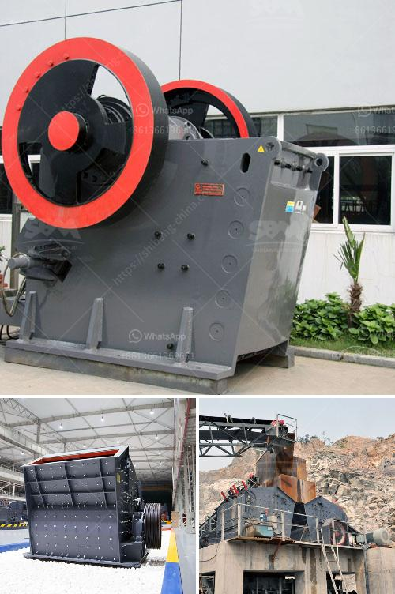

<h3>potassium ore production equipment</h3>
Potassium ore, also known as potash, is a vital resource used in various industries worldwide. It plays a crucial role in agriculture, primarily as a fertilizer, while also being used in the production of glass, detergents, and other chemical compounds. As the demand for potash continues to grow, the need for efficient potassium ore production equipment becomes increasingly important.

Potash deposits are typically found deep underground, making mining operations challenging and costly. Therefore, specialized equipment is required to extract and process potassium ore effectively. This equipment must be capable of both excavating the ore and separating it from other minerals and impurities.

One essential piece of equipment used in potash mining is the continuous mining machine. This heavy-duty machine cuts into the ore deposit, extracting large chunks of potash ore as it moves forward. Continuous mining machines are equipped with large rotating steel drums with multiple cutting bits that break through the rock and collect the ore.

To separate the potassium ore from other minerals, flotation cells are used. Flotation is a process that utilizes a surfactant to create a froth layer on top of a suspension. The froth contains the desired ore particles, which can then be skimmed off and collected. In the case of potash mining, flotation cells are used to separate the potassium chloride from other impurities before further processing.

Once the potassium ore has been extracted and separated, it undergoes another crucial step called beneficiation. Beneficiation involves crushing the ore into smaller pieces to increase its surface area and expose more of the valuable potassium chloride. This process helps improve the efficiency of subsequent extraction methods.

After beneficiation, the ore is further processed through a compaction system. This system involves compressing the crushed ore into granules, which are easier to handle and transport. Compaction also enhances the solubility of potash, making it an ideal form for fertilizer applications.

Potassium ore production equipment also includes drying systems. After the compaction process, the granules may still contain moisture. Drying systems remove this moisture, ensuring the potassium fertilizer remains in a stable and usable form. Efficient drying systems are essential to prevent clumping or spoilage of the product.

Efforts are continually being made to improve potassium ore production equipment. Technological advancements have led to the development of more efficient mining machines, flotation cells, and drying systems. These advancements help increase productivity, reduce operational costs, and minimize environmental impact.

In conclusion, potassium ore production equipment plays a significant role in meeting the growing demand for potash. The specialized machines used in potash mining ensure the efficient extraction, separation, and processing of potassium ore. As technology continues to advance, further improvements in equipment design and efficiency can be expected, making potash mining an increasingly sustainable and economically viable industry.
<h3>Contact us</h3><ul><li><strong>Whatsapp:&nbsp;<a href="https://wa.me/8613661969651">+8613661969651</a></strong></li><li><a href="https://swt.shibang-china.com/?git&amp;zhl&amp;potassium ore production equipment"><strong>Online Service(chat now)</strong></a></li></ul><h3>Related</h3><ul><li><a href='complete rock crusher machine prices in pakistan.md'>complete rock crusher machine prices in pakistan</a></li><li><a href='stone hammer mill machine.md'>stone hammer mill machine</a></li><li><a href='river stone crusher plant for sale in india.md'>river stone crusher plant for sale in india</a></li><li><a href='crushing plant zenith.md'>crushing plant zenith</a></li><li><a href='jaw impact crusher poland.md'>jaw impact crusher poland</a></li></ul>