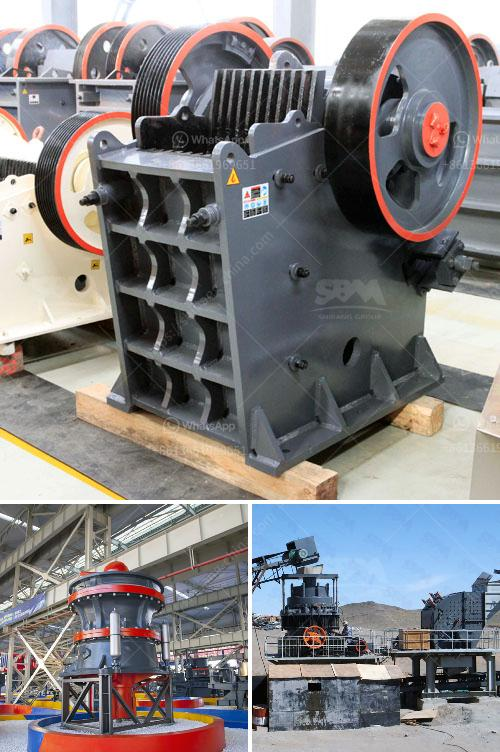

<h3>potential of mica wet grinding plant</h3>
Mica is a naturally occurring mineral that is widely used in various industries such as cosmetics, automotive, electronics, and construction. It is a versatile ingredient, thanks to its unique properties, including high heat resistance, electrical insulating properties, and a range of colors. One of the main challenges in using mica is achieving the desired particle size for different applications. This is where a mica wet grinding plant comes into play.

A mica wet grinding plant is a facility used to process mica into fine particle sizes for various applications. Used in paint, plastics, rubber, ceramics, and other industries, mica powder enhances the quality and durability of consumer products. The wet grinding process involves using water to break down the mica into smaller particles through friction and impact. This process ensures a high-quality final product with the desired particle size distribution.

One of the main advantages of a mica wet grinding plant is its efficiency in producing fine particles. The wet grinding process allows for better control over the particle size distribution, resulting in a more uniform and consistent product. This is crucial for applications where the particle size has a significant impact on the performance and aesthetics of the final product.

Moreover, a mica wet grinding plant offers several environmental benefits. By using water as a medium, it reduces the generation of dust during the grinding process, minimizing the potential health risks associated with airborne particles. Additionally, water acts as a natural coolant, preventing overheating and maintaining the integrity of the mica particles. This eliminates the need for additional energy-intensive cooling systems, reducing both energy consumption and carbon emissions.

Furthermore, a mica wet grinding plant can help optimize production efficiency. With advanced grinding equipment and automation systems, operators can monitor and control the process more effectively, ensuring consistent results and minimizing waste. The facility can also be designed to handle large volumes of mica, allowing for economies of scale and reducing production costs.

The market demand for mica and mica-based products is steadily growing, driven by the expanding consumer electronics and cosmetics industries. As a result, investing in a mica wet grinding plant presents a lucrative opportunity for manufacturers and entrepreneurs. By offering high-quality mica powder with a controlled particle size, they can meet the stringent requirements of their customers and gain a competitive edge.

In conclusion, the potential of a mica wet grinding plant is immense. With its ability to produce fine particles, reduce environmental impact, and optimize production efficiency, it offers numerous advantages for manufacturers and end-users alike. The demand for mica and mica-based products is expected to rise, making this investment an attractive opportunity for business growth. As the industry continues to evolve, a mica wet grinding plant will play a crucial role in meeting the increasing demand for high-quality mica powder.
<h3>Contact us</h3><ul><li><strong>Whatsapp:&nbsp;<a href="https://wa.me/8613661969651">+8613661969651</a></strong></li><li><a href="https://swt.shibang-china.com/?git&amp;zhl&amp;potential of mica wet grinding plant"><strong>Online Service(chat now)</strong></a></li></ul><h3>Related</h3><ul><li><a href='crusher in the philippines.md'>crusher in the philippines</a></li><li><a href='dry ball milling process.md'>dry ball milling process</a></li><li><a href='cost 100tpd cement plant india.md'>cost 100tpd cement plant india</a></li><li><a href='grinding mill material.md'>grinding mill material</a></li><li><a href='quarry crusher equipment costs.md'>quarry crusher equipment costs</a></li></ul>