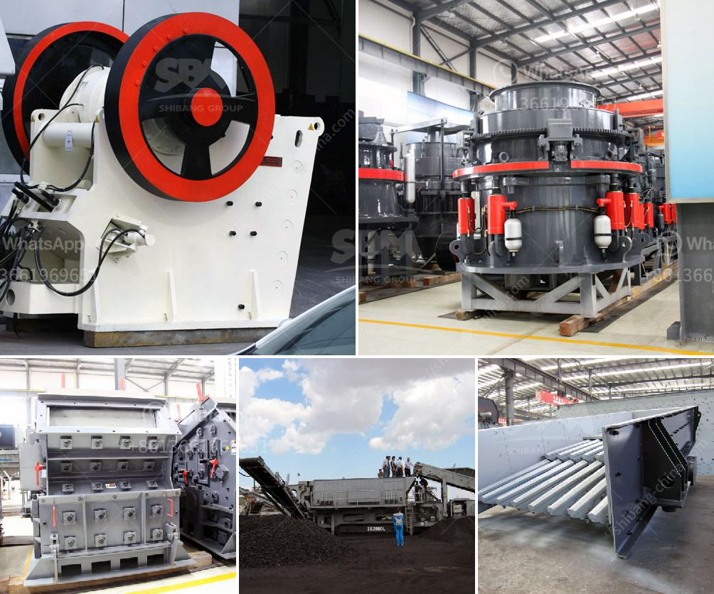

<h3>powder ball milling machines</h3>
Powder ball milling machines have emerged as a reliable and cost-effective method for producing fine and uniform powders in various industries. These machines are capable of grinding different materials into powders of varying particle sizes, making them ideal for applications in pharmaceuticals, chemicals, ceramics, food, and other sectors.

The principle behind powder ball milling revolves around the use of a rotating cylindrical chamber filled with grinding media such as balls or rods. As the chamber rotates, the grinding media continuously impacts and grinds the material within it. This action results in the reduction of particle size, enabling the production of powders with desired characteristics.

One of the key advantages of powder ball milling machines is their ability to control the particle size distribution of the resulting powders. By altering factors such as the rotational speed, grinding time, and the size and material composition of the grinding media, operators can achieve powders with specific particle size ranges. This control is crucial for industries that rely on consistent and precise powders for their products.

Another significant benefit of powder ball milling machines is their versatility. These machines can process a wide range of materials, including hard and soft minerals, brittle materials, pigments, and even toxic substances, with minimal contamination. This feature makes them suitable for industries that handle diverse materials and require efficient grinding solutions without compromising product quality.

Furthermore, powder ball milling machines are known for their energy efficiency. Compared to traditional grinding methods, such as hammer mills or attritors, these machines consume less power for the same level of milling, reducing overall operational costs for industries. This energy efficiency is achieved through the unique design and the controlled grinding environment provided by these machines.

In conclusion, powder ball milling machines have become an indispensable tool for industries seeking efficient and reliable grinding solutions. With their ability to produce fine and uniform powders, control particle size distribution, process a wide range of materials, and minimize energy consumption, these machines are revolutionizing various sectors. As industries continue to evolve and demand more advanced materials, powder ball milling machines will continue to play a pivotal role in empowering industries with efficient grinding solutions.
<h3>Contact us</h3><ul><li><strong>Whatsapp:&nbsp;<a href="https://wa.me/8613661969651">+8613661969651</a></strong></li><li><a href="https://swt.shibang-china.com/?git&amp;zhl&amp;powder ball milling machines"><strong>Online Service(chat now)</strong></a></li></ul><h3>Related</h3><ul><li><a href='jaw impact crusher poland.md'>jaw impact crusher poland</a></li><li><a href='grinding mill power.md'>grinding mill power</a></li><li><a href='ballast crushing machine kenya.md'>ballast crushing machine kenya</a></li><li><a href='sell jaw crusher.md'>sell jaw crusher</a></li><li><a href='porur raymond grinding mill.md'>porur raymond grinding mill</a></li></ul>