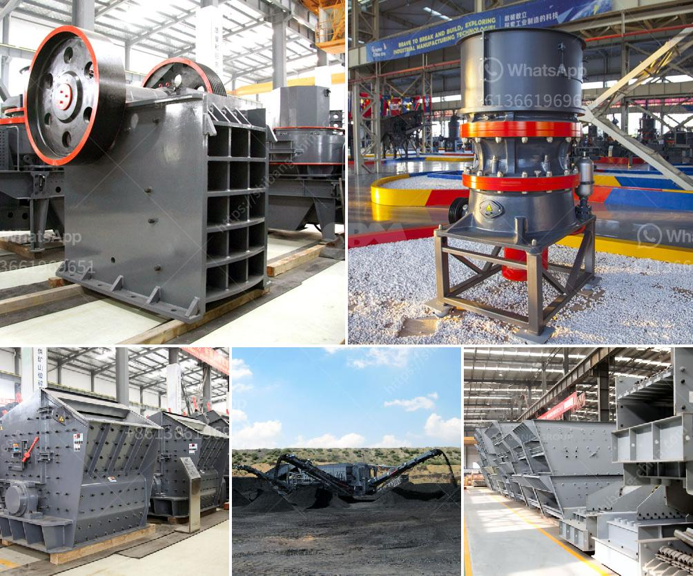

<h3>powder making machine</h3>
In today's fast-paced world, manufacturers are constantly looking for ways to improve efficiency, reduce costs, and maximize productivity. One revolutionary piece of equipment that has gained significant popularity in recent years is the powder making machine. This state-of-the-art device is transforming the way various industries produce powdered substances.

A powder making machine is a versatile tool used to grind materials into fine powders. It operates on the principle of impact and friction, where two or more components come into contact and collide, resulting in the reduction of larger particles into smaller, particle-sized powders. The range of materials that can be processed using these machines is vast, including minerals, chemicals, pharmaceuticals, and even food ingredients.

One of the most significant advantages of powder making machines is their ability to maintain precise control over the particle size distribution. This level of control ensures consistency and uniformity in the final product, which is crucial in many applications. For example, in the pharmaceutical industry, accurately sized powders are crucial for tablet formulation, where the dissolution rate and overall efficacy of the medication can be significantly impacted by particle size.

Furthermore, powder making machines offer exceptional versatility by allowing manufacturers to adjust the machine's settings to meet specific output requirements. By modifying factors such as rotational speed, feed rate, and grinding media, manufacturers can achieve desired particle sizes for different applications. This adaptability allows businesses to streamline their manufacturing processes, making them more efficient and cost-effective.

Another benefit of powder making machines is their ability to minimize heat generation during the grinding process. Unlike traditional grinding methods where excessive heat can affect the integrity of the material, these machines use advanced cooling systems to prevent overheating. This temperature control protects the quality and properties of the material being processed, making it ideal for applications that require heat-sensitive substances, such as certain pharmaceutical compounds or food ingredients.

Furthermore, powder making machines are designed with safety in mind. They incorporate various safety mechanisms and features to ensure the protection of operators and prevent accidents. These safety features typically include interlocks, emergency stop buttons, and overload protection, among others. With these safety measures in place, businesses can operate their powder making machines with peace of mind, avoiding potential risks and liabilities.

As technology continues to advance, the future of powder making machines looks promising. Manufacturers are constantly improving their efficiency, ease of use, and overall performance. This is being achieved through the integration of automation, machine learning algorithms, and advanced sensors, among other technological advancements. These developments will drive the industry forward, allowing businesses to produce higher volumes of powdered substances with even greater precision and control.

In conclusion, powder making machines are revolutionizing the manufacturing processes across various industries. They offer precise control over particle size distribution, versatility in output requirements, minimal heat generation, and enhanced safety features. As technology continues to evolve, these machines will play a crucial role in improving efficiency, reducing costs, and ultimately maximizing productivity for businesses worldwide.
<h3>Contact us</h3><ul><li><strong>Whatsapp:&nbsp;<a href="https://wa.me/8613661969651">+8613661969651</a></strong></li><li><a href="https://swt.shibang-china.com/?git&amp;zhl&amp;powder making machine"><strong>Online Service(chat now)</strong></a></li></ul><h3>Related</h3><ul><li><a href='qustion about ball milling process.md'>qustion about ball milling process</a></li><li><a href='decibels generated by hebro jaw crusher.md'>decibels generated by hebro jaw crusher</a></li><li><a href='gold mining equipment for sale in singapore.md'>gold mining equipment for sale in singapore</a></li><li><a href='gold crusher philippines.md'>gold crusher philippines</a></li><li><a href='construction waste recycling.md'>construction waste recycling</a></li></ul>